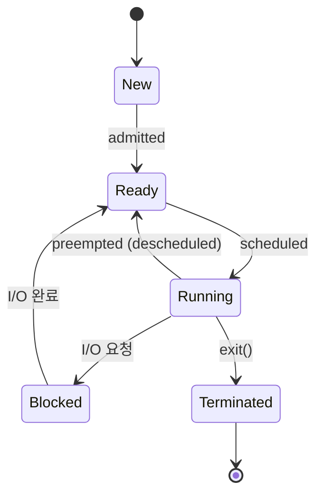

+++
date = '2025-12-13T10:00:00+09:00'
draft = false
title = '[OSTEP] Ch.04 - The Abstraction - The Process'
description = "OSTEP CPU 가상화 파트 - The Abstraction - The Process 정리 노트"
tags = ["OS", "OSTEP", "Virtualization"]
categories = ["OS"]
series = ["OSTEP 정리"]
+++
## Crux (핵심 문제)
> CPU가 하나뿐인데, 어떻게 여러 프로그램이 동시에 실행되는 것처럼 보이게 할 것인가? OS는 어떤 추상화를 통해 이 illusion을 만들어내는가?

## 배경 & 동기

프로그램은 디스크에 죽어있는 바이트 덩어리다. OS가 그것을 메모리에 올려서 실행시키는 순간 **Process**가 된다. 우리는 동시에 수십 개의 앱을 띄우지만 CPU는 한두 개다. 이 gap을 메우는 게 이 챕터의 핵심이다.

## Mechanism (어떻게 동작하는가)

### Process의 구성 요소 (Machine State)
프로세스를 완전히 설명하려면 다음이 필요하다:
- **Address Space** — 코드, 데이터, 스택, 힙이 들어있는 메모리 영역
- **Registers** — PC(Program Counter), Stack Pointer, 범용 레지스터
- **I/O 정보** — 현재 열려있는 파일 목록

### Process 생성 과정
```
디스크의 프로그램 → 메모리 로드 → 스택/힙 초기화 → main() 실행
```
1. OS가 코드와 static 데이터를 메모리(Address Space)에 로드
2. 스택 생성 & `argc`, `argv` 초기화
3. 힙 공간 할당 (malloc/free를 위한)
4. stdin/stdout/stderr 파일 디스크립터 설정
5. `main()`으로 점프 → 프로세스 시작

> [!important]
> 현대 OS는 **Lazy Loading**: 실제로 필요한 페이지만 그때그때 메모리에 올린다 (Paging/Swapping과 연결됨).

### Process States (프로세스 상태)



| 상태 | 의미 |
|------|------|
| **Running** | CPU에서 명령어 실행 중 |
| **Ready** | 실행 준비됐지만 OS가 아직 선택 안 함 |
| **Blocked** | I/O 등 이벤트 대기 중 (CPU를 양보한 상태) |
| **Zombie** | 종료했지만 부모가 아직 `wait()` 안 한 상태 |

### PCB (Process Control Block)
OS가 각 프로세스에 대해 유지하는 자료구조. xv6에서는 `struct proc`:

```c
struct proc {
    char *mem;              // 메모리 시작 주소
    uint sz;                // 메모리 크기
    char *kstack;           // 커널 스택
    enum proc_state state;  // 현재 상태
    int pid;                // 프로세스 ID
    struct proc *parent;    // 부모 프로세스
    struct context context; // 레지스터 컨텍스트 (Context Switch 시 저장)
    struct trapframe *tf;   // 현재 인터럽트의 Trap Frame
};
```

Context Switch가 발생하면 현재 프로세스의 레지스터 값이 `context`에 저장되고, 다음 프로세스의 `context`가 복원된다.

## Policy (왜 이렇게 설계했는가)

**Mechanism vs Policy 분리:**
- Mechanism: Context Switch를 어떻게 구현하는가 (하드웨어 레벨)
- Policy: 다음에 어떤 프로세스를 실행할 것인가 (스케줄링 알고리즘)

이 둘을 분리함으로써 스케줄링 정책만 바꿔도 메커니즘은 재사용 가능 → 모듈성.

**Time Sharing vs Space Sharing:**
- Time Sharing: CPU를 시간적으로 나눠 씀 (프로세스 스케줄링)
- Space Sharing: 메모리를 공간적으로 나눠 씀 (각 프로세스별 Address Space)

## 내 정리
결국 이 챕터는 **"실행 중인 프로그램"이라는 개념을 OS 레벨에서 어떻게 표현하는가**를 설명한다. Process = Address Space + Registers + I/O State. OS는 Process List(PCB들의 집합)를 통해 모든 프로세스를 관리하고, 상태 전이를 통해 CPU를 효율적으로 공유한다.

## 연결
- 이전: Ch.02 - Introduction to Operating Systems
- 다음: Ch.05 - Interlude - Process API
- 관련 개념: Process, PCB (Process Control Block), Context Switch, Time Sharing
