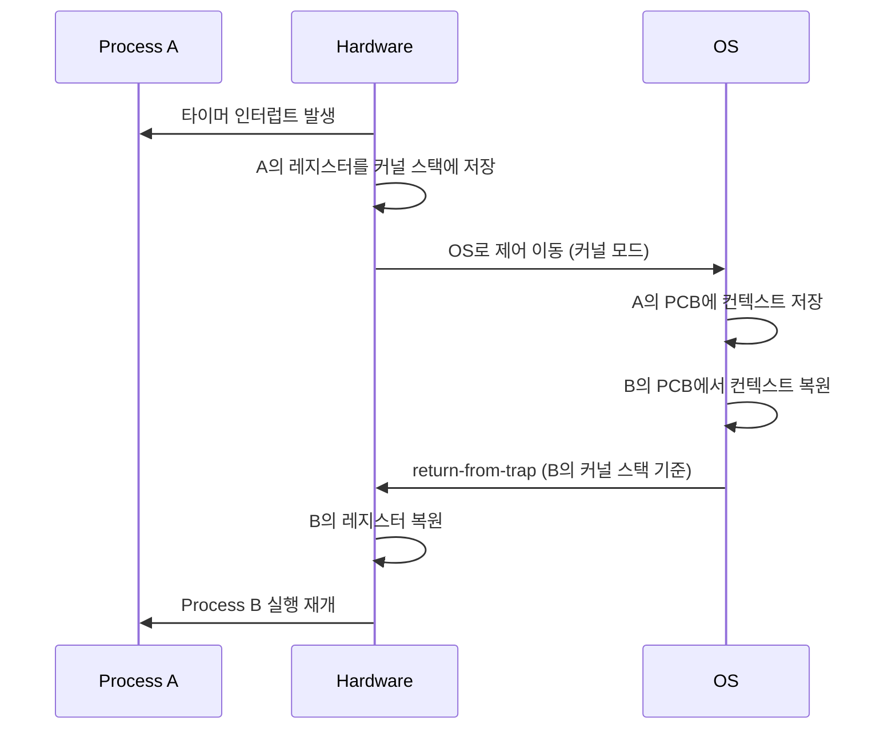

+++
date = '2025-12-18T10:00:00+09:00'
draft = false
title = '[OSTEP] Ch.06 - Mechanism - Limited Direct Execution'
description = "OSTEP CPU 가상화 파트 - Mechanism - Limited Direct Execution 정리 노트"
tags = ["OS", "OSTEP", "Virtualization"]
categories = ["OS"]
series = ["OSTEP 정리"]
+++
## Crux (핵심 문제)
> OS는 어떻게 프로그램을 효율적으로 실행하면서도 통제권을 잃지 않는가? 프로세스가 나쁜 짓을 못 하게 막으면서도 성능을 희생하지 않으려면?

## 배경 & 동기

CPU 가상화의 두 가지 난제:
1. **Performance** — 가상화 오버헤드 없이 빠르게 실행하려면?
2. **Control** — 프로세스가 OS 권한 밖의 일을 못 하게 막으려면?

가장 단순한 답: 그냥 CPU에서 직접 돌리자(Direct Execution). 하지만 이렇게 하면 프로그램이 무제한 권한을 갖게 돼 위험하다. → **Limited** Direct Execution.

## Mechanism (어떻게 동작하는가)

### 문제 1: Restricted Operations (제한된 연산)

**해결책: User Mode vs Kernel Mode 분리**

```
User Mode (제한적)          Kernel Mode (전능)
─────────────────           ─────────────────
일반 명령어 실행 가능        I/O, 메모리 관리 등 모든 작업 가능
I/O 직접 불가               인터럽트 처리
권한 상승 불가
```

프로세스가 디스크 I/O 같은 특권 작업을 하고 싶으면? → **System Call**

#### System Call의 동작 과정

```
User program                OS (Kernel)           Hardware
────────────                ───────────           ────────
open() 호출
  trap 명령어 실행  ──────→                      레지스터 저장
                                                  커널 모드 전환
                   ←──────  trap handler로 점프
                            시스템 콜 처리
                   ──────→  return-from-trap      레지스터 복원
                                                  유저 모드 전환
trap 이후 재개 ←──────────
```

**Trap의 핵심:**
- trap 실행 시 PC, flags, 레지스터를 커널 스택에 저장
- 커널 모드로 전환
- OS의 trap handler 실행
- return-from-trap으로 복귀

**Trap Table (부팅 시 설정):**
OS가 부팅 때 "어떤 이벤트가 발생하면 어디로 가라"는 테이블을 하드웨어에 등록. 이후 하드웨어가 trap 발생 시 이 테이블 참조.

> [!important]
> 프로세스는 trap table의 위치를 직접 바꿀 수 없다.
> 만약 바꿀 수 있다면 OS를 완전히 우회할 수 있기 때문 → 특권 명령어로만 설정 가능.

### 문제 2: Switching Between Processes (Context Switch)

OS가 실행 중인 프로세스를 어떻게 바꾸는가?

**방법 1: Cooperative Approach (옛날 방식)**
- 프로세스가 자발적으로 CPU를 양보할 때까지 기다림
- 무한 루프에 빠지면? → 리부팅 밖에 방법 없음

**방법 2: Non-cooperative (Interrupt, 현대 방식)**

```
하드웨어: 주기적으로 타이머 인터럽트 발생
OS: 인터럽트 핸들러에서 현재 프로세스 멈추고 다음 프로세스 실행
```

#### Context Switch 상세 과정



**두 단계 레지스터 저장:**
1. 하드웨어가 타이머 인터럽트 시 user-level 레지스터를 커널 스택에 저장
2. OS가 context switch 시 kernel-level 레지스터를 PCB(struct context)에 저장

## Policy (왜 이렇게 설계했는가)

| 구분 | 방식 | Trade-off |
|------|------|-----------|
| Cooperative | 자발적 yield | 단순하지만 무한루프에 취약 |
| Non-cooperative | Timer interrupt | 안전하지만 인터럽트 오버헤드 있음 |

**LDE 프로토콜 전체 요약:**

```
[부팅 시]
OS: trap table 설정 → 하드웨어: 위치 기억

[프로세스 실행 시]
OS: 프로세스 생성 → return-from-trap → 유저 모드에서 실행

[System Call 시]
프로세스: trap → OS: 처리 → return-from-trap → 유저 모드 복귀

[Context Switch 시]
타이머 인터럽트 → OS: 현재 컨텍스트 저장 → 다음 컨텍스트 복원 → return-from-trap
```

> [!important]
> "Limited"의 의미: 프로그램은 CPU에서 직접 실행(빠름)되지만,
> 특권 작업은 반드시 OS를 통해야 하고(안전함), OS는 타이머로 통제권을 유지한다.

## 내 정리
결국 이 챕터는 **OS가 어떻게 빠르면서도 안전하게 프로그램을 실행하는가**를 다룬다. 핵심 답변: User/Kernel Mode 분리 + Trap 메커니즘 + 타이머 인터럽트. 이 세 가지가 없으면 OS는 프로세스를 통제할 수 없다 — "OS는 그냥 라이브러리에 불과하게 된다."

## 연결
- 이전: Ch.05 - Interlude - Process API
- 다음: Ch.07 - Scheduling - Introduction
- 관련 개념: System Call, Trap, Context Switch, PCB (Process Control Block)
