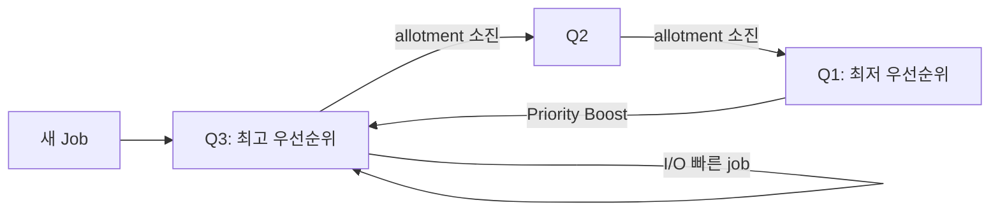

+++
date = '2025-12-22T10:00:00+09:00'
draft = false
title = '[OSTEP] Ch.08 - Scheduling - The Multi-Level Feedback Queue'
description = "OSTEP CPU 가상화 파트 - Scheduling - The Multi-Level Feedback Queue 정리 노트"
tags = ["OS", "OSTEP", "Virtualization"]
categories = ["OS"]
series = ["OSTEP 정리"]
+++
## Crux (핵심 문제)
> job의 실행 시간을 미리 모르는 상황에서, 어떻게 Turnaround time과 Response time을 동시에 최적화할 수 있는가?

## 배경 & 동기

Ch.07의 결론: SJF/STCF는 Turnaround에 좋지만 job 길이를 알아야 한다. RR은 Response에 좋지만 Turnaround가 나쁘다. 현실 OS는 job 길이를 모른다. → **과거 행동을 관찰해서 미래를 예측하자** = MLFQ.

MLFQ는 1962년 Corbato가 CTSS(Compatible Time-Sharing System)에서 처음 제안. 이 공로로 Turing Award 수상.

## Mechanism (어떻게 동작하는가)

### 기본 구조

MLFQ = 여러 개의 큐 + 각 큐마다 다른 우선순위

```
[High Priority] Q8  ─ A, B (새 job 또는 interactive)
                Q7
                Q6
                Q5
                Q4  ─ C (어느 정도 CPU 씀)
                Q3
                Q2
[Low Priority]  Q1  ─ D (오래 CPU를 쓴 batch job)
```

**기본 규칙:**
- Rule 1: Priority(A) > Priority(B) → A만 실행
- Rule 2: Priority(A) = Priority(B) → RR으로 실행

### 우선순위 조정 규칙 (진화 과정)

#### 1차 시도

- Rule 3: 새 job은 최고 우선순위 큐에 진입
- Rule 4a: 할당된 time slice를 다 쓰면 → 한 단계 강등
- Rule 4b: time slice 이전에 CPU 양보(I/O 등) → 같은 우선순위 유지

**직관**: job이 짧으면 최고 우선순위에서 빨리 끝남 → SJF 근사. job이 길면 점점 강등됨 → Batch job 취급.

#### 문제점들

1. **Starvation**: interactive job이 많으면 low-priority job이 CPU를 못 받음
2. **Gaming**: 매 time slice 직전에 I/O 발행 → 우선순위 강등 회피 → CPU 독점
3. **행동 변화**: CPU-bound였다가 interactive로 바뀌면? 낮은 우선순위에 갇힘

#### 2차 시도: Priority Boost

- **Rule 5**: 주기 S마다 모든 job을 최고 우선순위 큐로 올림

```
우선순위 부스트 없을 때: long-running job 굶주림
우선순위 부스트 있을 때: 주기적으로 최상위로 올라와 RR 실행 기회 얻음
```

> [!question]
> S를 얼마로 설정해야 하는가? 너무 작으면 interactive job 방해, 너무 크면 굶주림 발생. Ousterhout는 이를 "voo-doo constant"라 불렀다 — 경험적으로 튜닝해야 함.

#### 3차 시도: Better Accounting (Gaming 방지)

Rule 4a, 4b를 통합:
- **Rule 4 (최종)**: 해당 레벨에서 allotment(시간 할당량)를 모두 소진하면 강등. I/O를 했어도 누적으로 계산.

```
나쁜 예: 매번 99% 지점에서 I/O → 우선순위 유지로 CPU 독점
개선 후: 누적 CPU 시간이 allotment 초과 → 강등, gaming 불가
```

### 최종 MLFQ 5가지 규칙

| 규칙 | 내용 |
|------|------|
| Rule 1 | Priority(A) > Priority(B) → A 실행 |
| Rule 2 | Priority(A) = Priority(B) → RR |
| Rule 3 | 새 job → 최고 우선순위 큐 |
| Rule 4 | allotment 소진 → 한 단계 강등 (I/O 포함 누적) |
| Rule 5 | 주기 S마다 모든 job을 최상위로 부스트 |

## Policy (왜 이렇게 설계했는가)

**MLFQ가 달성하는 것:**
- **Short jobs** (interactive): 최상위에서 빠른 Response time
- **Long jobs** (batch): 낮은 우선순위지만 Priority Boost로 굶주림 방지
- **CPU 사용 패턴 학습**: 역사 기반으로 job 특성 추론

**실제 구현 예:**
- Solaris: 60개 큐, 20ms~수백ms time slice, ~1초마다 priority boost
- FreeBSD: 수식으로 우선순위 계산, decay-usage 방식
- Linux: CFS(Completely Fair Scheduler) — 다른 접근법이지만 비슷한 목표

> [!important]
> MLFQ의 핵심: **미래를 예측하기 위해 과거를 관찰한다**.
> Branch predictor, TLB, Cache 등 하드웨어도 같은 원리. Locality를 이용한 예측.



## 내 정리
결국 이 챕터는 **"미래를 모른다면 과거를 봐라"는 원리로 SJF와 RR의 장점을 합친** MLFQ를 설명한다. 새 job은 일단 최고 우선순위로 시작해서 (short job 가정), CPU를 많이 쓸수록 점점 강등된다. Priority Boost로 starvation을 방지하고, allotment 누적 계산으로 gaming을 막는다. 실제로 대부분의 현대 OS가 이 방식(또는 변형)을 쓴다.

## 연결
- 이전: Ch.07 - Scheduling - Introduction
- 다음: Ch.09 - Scheduling - Proportional Share
- 관련 개념: Scheduling Policy, Context Switch, Time Sharing
