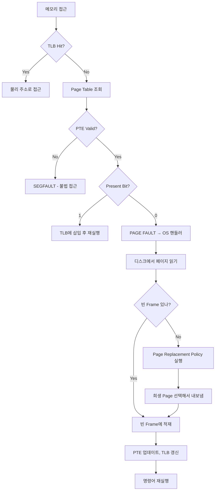

+++
date = '2026-01-17T10:00:00+09:00'
draft = false
title = '[OSTEP] Ch.21 - Beyond Physical Memory - Mechanisms'
description = "OSTEP 메모리 가상화 파트 - Beyond Physical Memory - Mechanisms 정리 노트"
tags = ["OS", "OSTEP", "Virtualization"]
categories = ["OS"]
series = ["OSTEP 정리"]
+++
## Crux (핵심 문제)
> 물리 메모리보다 더 큰 Address Space를 어떻게 지원하는가? 메모리에 안 들어가는 페이지를 어디에 두고 어떻게 가져오는가?

## 배경 & 동기

지금까지는 모든 프로세스의 모든 페이지가 물리 메모리에 있다고 가정했다. 현실:
- 메모리는 항상 부족하다
- 프로세스가 실제로 사용하는 페이지는 전체의 일부 (Working Set)
- 나머지는 디스크에 두고 필요할 때만 가져오면 된다

→ **Swap Space**: 디스크의 일부를 페이지 저장용으로 예약.

## Mechanism (어떻게 동작하는가)

### Swap Space

```
Physical Memory (4 frames):
┌──────────┬──────────┬──────────┬──────────┐
│Proc0[VP0]│Proc1[VP2]│Proc1[VP3]│Proc2[VP0]│
└──────────┴──────────┴──────────┴──────────┘

Swap Space (8 blocks, disk):
┌───┬───┬────┬───┬───┬───┬───┬───┐
│P0 │P0 │free│P1 │P1 │P3 │P2 │P3 │
│VP1│VP2│    │VP0│VP1│VP0│VP1│VP1│
└───┴───┴────┴───┴───┴───┴───┴───┘
```

- swap space는 OS가 페이지를 디스크에 내보낼 때 사용
- 코드 페이지는 원본 실행파일에서 다시 읽어올 수 있어 swap space 불필요
- OS는 각 페이지의 디스크 주소를 PTE에 저장 (present=0일 때)

### Present Bit

PTE에 **Present Bit** 추가:
- `1`: 페이지가 물리 메모리에 있음 → 정상 접근
- `0`: 페이지가 디스크에 있음(swap out됨) → **Page Fault** 발생

### Page Fault 처리 흐름



**주요 포인트:**
- Page Fault는 불법 접근이 아니다 (합법적이지만 메모리에 없는 것)
- I/O 중 프로세스는 **Blocked** 상태 → OS가 다른 프로세스 실행 (오버랩)
- Page Fault 처리는 소프트웨어 (OS) — 디스크 I/O가 이미 느려서 SW 오버헤드 무시 가능

### Page Fault Control Flow

**하드웨어 (TLB Miss → Page Table 조회 시):**
```c
if (PTE.Present == True)
    TLB_Insert(VPN, PTE.PFN, PTE.ProtectBits);
    RetryInstruction();
else
    RaiseException(PAGE_FAULT);  // OS로 제어 이동
```

**OS (Page Fault Handler):**
```c
PFN = FindFreePhysicalPage();
if (PFN == -1)
    PFN = EvictPage();     // Page Replacement 정책 실행
DiskRead(PTE.DiskAddr, PFN);  // 디스크에서 읽기 (I/O)
PTE.Present = True;
PTE.PFN = PFN;
RetryInstruction();
```

## Policy (왜 이렇게 설계했는가)

**Swap의 효과:**
- 프로세스가 실제로 사용하는 Working Set이 물리 메모리에 들어가면 → 거의 Page Fault 없음
- Working Set이 물리 메모리보다 크면 → Thrashing (Page Fault 폭발적 증가)

**Proactive vs Reactive:**
- **Reactive**: Page Fault 발생 시 그때 처리
- **Proactive**: OS가 미리 빈 frame을 확보해두는 **Page Daemon** 실행
  - Low watermark 도달 시 Page Daemon 가동
  - High watermark까지 frame 확보 후 대기

> [!important]
> Page Fault 처리 중 CPU는 다른 프로세스 실행 → I/O와 CPU 오버랩.
> 이것이 Multiprogramming의 CPU 활용도 이점.

**코드 페이지 vs 데이터 페이지:**
- 코드: 읽기 전용, 디스크의 실행파일에서 다시 읽으면 됨 → swap space 불필요
- 데이터: 수정됐으면 swap space에 써야 함 (dirty bit 확인)

## 내 정리
결국 이 챕터는 **물리 메모리를 넘어서는 주소 공간 지원의 메커니즘**을 설명한다. Swap Space에 페이지를 보내고, Present Bit으로 추적하며, Page Fault 시 OS가 디스크에서 가져온다. 이 과정에서 CPU와 I/O 오버랩으로 효율을 높인다. 어떤 페이지를 내보낼지는 다음 챕터의 Page Replacement Policy.

## 연결
- 이전: Ch.20 - Paging - Smaller Tables
- 다음: Ch.22 - Beyond Physical Memory - Policies
- 관련 개념: Page Fault, Swapping, Page Table, TLB
