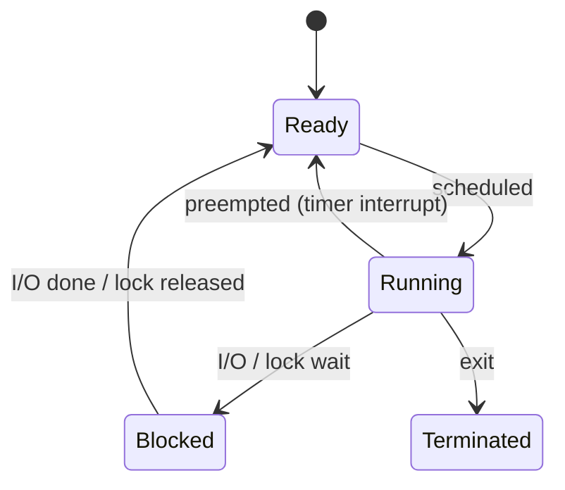

+++
date = '2026-01-24T10:00:00+09:00'
draft = false
title = '[OSTEP] Ch.26 - Concurrency - An Introduction'
description = "OSTEP 동시성 파트 - Concurrency - An Introduction 정리 노트"
tags = ["OS", "OSTEP", "Concurrency"]
categories = ["OS"]
series = ["OSTEP 정리"]
+++
## Crux (핵심 문제)
프로세스 안에서 여러 실행 흐름(Thread)을 동시에 돌리면 공유 데이터를 건드릴 때 예측 불가한 결과가 생긴다. 어떻게 올바른 동시 실행을 보장할 것인가?

## 배경 & 동기

지금까지 CPU와 메모리를 가상화해서 "각 프로세스가 혼자 기계를 독점"하는 환상을 만들었다. 이제 한 프로세스 안에서 여러 실행 흐름, 즉 Thread를 도입한다.

Thread가 필요한 이유 두 가지:
1. **병렬화(Parallelism)** — 멀티 코어를 활용해 대형 연산을 빠르게
2. **I/O 오버랩(Overlap)** — 한 스레드가 I/O 대기 중일 때 다른 스레드가 CPU를 쓸 수 있음 (멀티프로그래밍의 스레드 버전)

## Mechanism (어떻게 동작하는가)

### Thread vs Process

| 비교 항목 | Process | Thread |
|-----------|---------|--------|
| 주소 공간 | 개별 | **공유** |
| 레지스터 | 개별 | 개별 (TCB에 저장) |
| Stack | 개별 | **스레드마다 별도 stack** |
| Context Switch 비용 | 높음 (Page Table 교체) | 낮음 (Page Table 유지) |

Thread는 PCB (Process Control Block)와 유사한 **TCB(Thread Control Block)**에 레지스터 상태를 저장한다. Context Switch 시 주소 공간은 그대로 유지되는 것이 핵심 차이점.

### 멀티스레드 주소 공간 레이아웃

```
0KB   ┌──────────────┐
      │  Code        │
      ├──────────────┤
      │  Heap        │
      ├──────────────┤
      │  (free)      │
      │              │
      ├──────────────┤
      │  Stack (T2)  │
      ├──────────────┤
      │  (free)      │
      ├──────────────┤
      │  Stack (T1)  │
16KB  └──────────────┘
```

Stack이 여러 개가 되므로 "무한 확장" 가정이 깨진다. 실제로 재귀가 깊지 않으면 보통 문제없다.

### 스레드 실행 순서는 비결정적

스레드 생성(`pthread_create`) 후 어떤 스레드가 먼저 실행될지는 **OS 스케줄러가 결정**한다. 개발자는 "A → B → C" 순서를 가정하면 안 된다.

```c
Pthread_create(&p1, NULL, mythread, "A");
Pthread_create(&p2, NULL, mythread, "B");
Pthread_join(p1, NULL);
Pthread_join(p2, NULL);
// 출력 순서: "A B", "B A" 모두 가능
```

### 공유 데이터 문제 — Race Condition

두 스레드가 같은 카운터를 증가시키면:

```c
// counter++ 는 어셈블리로 3개 명령어
mov 0x8049a1c, %eax   // load
add $0x1, %eax        // add
mov %eax, 0x8049a1c   // store
```

타이머 인터럽트가 `add`와 마지막 `mov` 사이에 끼어들면, 두 스레드 모두 "50을 51로 올리는" 동일한 작업을 중복 수행한다. 결과: 50→51 (52가 되어야 맞는데).

> [!important]
> `counter++` 같은 코드는 **Non-atomic**이다. 어셈블리 레벨에서 3개 명령이며, 그 사이에 인터럽트가 끼어들 수 있다. 이것이 Race Condition의 본질.

### Critical Section과 Atomicity

Critical Section: 공유 자원에 접근하는 코드 구역. 한 번에 **한 스레드만** 실행되어야 한다.

이를 보장하려면 **Atomic Operation**이 필요하다 — "읽고-수정하고-쓰는" 시퀀스가 마치 한 명령처럼 실행되어야 함.



## Policy (왜 이렇게 설계했는가)

### Mutual Exclusion이 없으면?
- 결과가 실행마다 달라짐 (비결정적)
- 디버깅 거의 불가능 (재현 어려움)
- 수천 번 실행 중 한 번만 터지는 버그 → 최악

### 왜 Thread를 Process 대신 쓰나?
- **데이터 공유** 용이 (같은 주소 공간)
- Context Switch 비용 적음
- 단, 공유가 양날의 검: 편리하지만 Race Condition 유발

> [!important]
> OS는 스레드 실행 순서를 임의로 바꿀 수 있다. "내 코드가 항상 이 순서로 실행된다"는 가정은 동시성 버그의 씨앗.

## 내 정리

결국 이 챕터는 **Thread라는 새로운 추상화**를 소개하면서, 이게 가져오는 근본적 문제인 Race Condition을 드러낸다. 공유 주소 공간은 편리하지만, 타이머 인터럽트가 어디서든 끼어들 수 있기 때문에 아무것도 "당연히 안전하지" 않다. 해결책은 다음 챕터들 — Lock, Condition Variable, Semaphore.

## 연결
- 이전: Ch.23 - Complete Virtual Memory Systems
- 다음: Ch.27 - Interlude - Thread API
- 관련 개념: Thread, Race Condition, Critical Section, Atomic Operation, Context Switch
