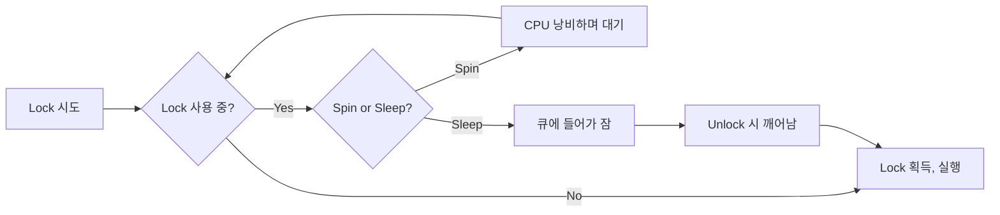

+++
date = '2026-01-29T10:00:00+09:00'
draft = false
title = '[OSTEP] Ch.28 - Locks'
description = "OSTEP 동시성 파트 - Locks 정리 노트"
tags = ["OS", "OSTEP", "Concurrency"]
categories = ["OS"]
series = ["OSTEP 정리"]
+++
## Crux (핵심 문제)
Critical Section을 원자적으로 실행하려면 어떻게 해야 하나? 효율적이고 공정하며 정확한 Lock을 어떻게 만들 수 있나?

## 배경 & 동기

`counter++`처럼 겉보기엔 단순한 코드도 어셈블리 레벨에선 여러 명령이다. 인터럽트가 중간에 끼어들면 Race Condition이 발생한다. Lock은 "이 코드 블록은 한 번에 하나의 스레드만 실행"을 보장하는 가장 기본적인 동기화 원시 타입이다.

```c
lock_t mutex;
lock(&mutex);
balance = balance + 1;  // critical section
unlock(&mutex);
```

## Mechanism (어떻게 동작하는가)

### Lock 평가 기준 3가지
1. **Correctness** — Mutual Exclusion 보장하는가?
2. **Fairness** — 대기 스레드가 결국 Lock을 얻는가? (Starvation 없는가?)
3. **Performance** — 오버헤드가 낮은가? (no contention, single CPU, multi CPU)

### 구현 역사: 점점 나아지는 과정

#### 방법 1: 인터럽트 비활성화 (단일 CPU 시절)
```c
void lock()   { DisableInterrupts(); }
void unlock() { EnableInterrupts(); }
```
- **장점**: 단순
- **단점**: 멀티프로세서에선 무의미, 악의적 코드가 인터럽트 끄고 CPU 독점 가능, I/O 인터럽트 누락 위험

#### 방법 2: 플래그 변수 (실패 사례)
```c
void lock(lock_t *m) {
    while (m->flag == 1) ;  // spin-wait
    m->flag = 1;
}
```
문제: `while` 체크와 `flag = 1` 사이에 인터럽트가 끼어들면 두 스레드가 동시에 진입. **Correctness 실패**.

#### 방법 3: Test-And-Set (하드웨어 지원)

```c
// 하드웨어가 원자적으로 실행
int TestAndSet(int *old_ptr, int new) {
    int old = *old_ptr;
    *old_ptr = new;
    return old;
}

void lock(lock_t *lock) {
    while (TestAndSet(&lock->flag, 1) == 1)
        ; // spin
}
void unlock(lock_t *lock) { lock->flag = 0; }
```

Spin Lock 완성! `TestAndSet`이 "읽고-쓰기"를 원자적으로 수행하기 때문에, 두 스레드가 동시에 0을 읽고 둘 다 lock 잡는 사태가 방지된다.

> [!important]
> Spin Lock은 **Correctness ✓**, **Fairness ✗** (굶어 죽을 수 있음), **Performance ✗** (단일 CPU에서 spin은 CPU 낭비).

#### 방법 4: Compare-And-Swap

```c
int CompareAndSwap(int *ptr, int expected, int new) {
    int actual = *ptr;
    if (actual == expected)
        *ptr = new;
    return actual;
}
```

Compare-and-Swap (CAS)은 Test-And-Set보다 강력하다 (lock-free 자료구조에도 활용).

#### 방법 5: Fetch-And-Add (티켓 락, Fairness 해결)

```c
int FetchAndAdd(int *ptr) {
    int old = *ptr;
    *ptr = old + 1;
    return old;
}

void lock(lock_t *lock) {
    int myturn = FetchAndAdd(&lock->ticket);
    while (lock->turn != myturn) ;  // spin
}
void unlock(lock_t *lock) { lock->turn++; }
```

번호표 시스템 — **Fairness ✓** (먼저 온 순서대로 처리).

#### Spin의 성능 문제 해결: OS 도움 받기

**Yield**: 스핀 대신 CPU를 양보
```c
void lock() {
    while (TestAndSet(&flag, 1) == 1)
        yield();  // 내 타임슬라이스 포기, ready queue로
}
```

**Park/Unpark**: 큐에 스레드를 재우고, 락 해제 시 깨우기
- Solaris의 `park()` / `unpark()` 방식
- Linux의 `futex` (fast userspace mutex) — 경합 없으면 커널 진입 없이 처리, 경합 있으면 커널로

> [!important]
> `futex`는 현대 Linux Mutex의 기반. 빠른 경로(fast path)는 userspace에서, 느린 경로(slow path)만 커널 syscall.

### Spin Lock vs Sleep Lock 비교



## Policy (왜 이렇게 설계했는가)

### 언제 Spin이 좋은가?
- 멀티 CPU에서 락 보유 시간이 짧을 때: sleep/wake overhead > spin 비용
- 컨텍스트 스위치 비용이 클 때

### 언제 Sleep이 좋은가?
- 단일 CPU: spin 중에 lock holder가 실행될 수 없으므로 의미 없음
- 락 보유 시간이 길 때

### 거친 락 vs 세밀한 락
- **Coarse-grained**: 하나의 큰 락으로 전체 자료구조 보호 → 단순하지만 성능 저하
- **Fine-grained**: 자료구조의 각 부분마다 별도 락 → 동시성 높지만 복잡

## 내 정리

결국 이 챕터는 **Lock을 밑바닥부터 만들어가는 여정**이다. 순수 소프트웨어로는 불가능하고, 하드웨어 원자 명령(Test-And-Set, CAS 등)이 필요하다. 그래도 Spin은 CPU를 낭비하므로, OS의 park/unpark 또는 futex를 통해 잠재워야 진짜 효율적인 Lock (Mutex)이 완성된다.

## 연결
- 이전: Ch.27 - Interlude - Thread API
- 다음: Ch.29 - Lock-based Concurrent Data Structures
- 관련 개념: Lock (Mutex), Spin Lock, Compare-and-Swap (CAS), Critical Section, Race Condition, Atomic Operation
