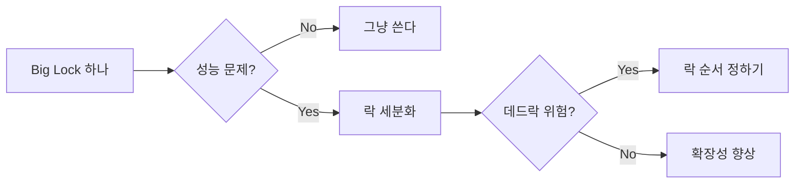

+++
date = '2026-01-31T10:00:00+09:00'
draft = false
title = '[OSTEP] Ch.29 - Lock-based Concurrent Data Structures'
description = "OSTEP 동시성 파트 - Lock-based Concurrent Data Structures 정리 노트"
tags = ["OS", "OSTEP", "Concurrency"]
categories = ["OS"]
series = ["OSTEP 정리"]
+++
## Crux (핵심 문제)
자료구조에 Lock을 추가해 Thread-safe하게 만들 때, 정확성(Correctness)과 성능(Performance/Scalability)을 동시에 어떻게 잡을 것인가?

## 배경 & 동기

Ch.28 - Locks에서 Lock 자체를 만드는 방법을 배웠다. 이제 그 Lock을 실제 자료구조(카운터, 연결 리스트, 해시맵 등)에 적용해보자. 단순히 "락 하나 씌우면 되지 않나?"에서 시작해서, 성능 문제로 점점 정교해지는 과정이다.

## Mechanism (어떻게 동작하는가)

### 패턴: 가장 단순한 접근 — 하나의 Big Lock

```c
typedef struct { int value; pthread_mutex_t lock; } counter_t;

void increment(counter_t *c) {
    Pthread_mutex_lock(&c->lock);
    c->value++;
    Pthread_mutex_unlock(&c->lock);
}
```

**Correctness ✓** — 완벽하다.
**Performance ✗** — 스레드 수가 늘면 락 경합이 심해져 직렬화됨. 4코어에서 4스레드가 각각 100만 번 돌리면, 싱글스레드보다 훨씬 느려진다.

### 확장 가능한 카운터: Approximate Counter

**아이디어**: CPU별 로컬 카운터 + 글로벌 카운터

```
CPU 0 → L0 (local lock)
CPU 1 → L1 (local lock)
CPU 2 → L2 (local lock)
CPU 3 → L3 (local lock)
           ↓ (임계값 S마다)
         Global G (global lock)
```

- 각 CPU는 자신의 로컬 카운터만 업데이트 → 경합 없음
- 로컬 카운터가 임계값 S에 도달하면 글로벌에 더하고 로컬 리셋
- `S` 작을수록 정확하지만 느림, 클수록 빠르지만 오차 발생

> [!important]
> **Trade-off**: 정확성 vs 확장성. S=1이면 정확한 카운터(느림), S=1024면 거의 글로벌 경합 없음(빠르지만 오차). 실무에서는 용도에 따라 S를 튜닝.

### 동시성 연결 리스트

**단순 버전**: 리스트 전체에 락 하나
- 정확하지만, 삽입/삭제가 직렬화됨

**Hand-over-Hand Locking (Lock Coupling)**:
- 노드마다 락을 가짐
- 순회할 때 현재 노드 락 잡은 뒤 다음 노드 락 잡고, 현재 노드 락 해제
- 동시성 높지만, 노드당 락 획득/해제 오버헤드로 실제로는 빠르지 않을 수 있음

> [!example]
> 리스트 길이 N에서 N번의 lock/unlock → 실제 throughput이 big lock보다 나쁠 때도 있다. "세밀한 락이 항상 좋다"는 착각.

### 동시성 큐

Michael-Scott Queue (락-프리 아님, 두 개의 락):
- `head_lock`: dequeue 시 사용
- `tail_lock`: enqueue 시 사용
- 더미(dummy) 노드로 head와 tail이 겹치는 경우 처리

enqueue와 dequeue가 동시에 일어나도 서로 다른 락을 잡으므로 실제로 병렬 동작 가능.

### 동시성 해시맵

```c
// 버킷마다 연결 리스트 + 락
typedef struct {
    hash_t lock;
    list_t lists[BUCKETS];
} concurrent_hash_t;
```

버킷이 많으면 경합이 자연히 줄어든다. 해시맵은 확장성이 좋은 이유가 여기 있다.

## Policy (왜 이렇게 설계했는가)

### 설계 원칙

1. **일단 Big Lock으로 시작하라** — 단순함이 정확성을 보장한다
2. **프로파일링 후 최적화** — 병목이 실제로 락 경합인지 확인
3. **세밀한 락은 복잡도를 높인다** — 데드락 위험, 디버깅 어려움



> [!important]
> 자료구조의 동시성 최적화는 **측정 먼저, 최적화 나중**. 불필요한 복잡성은 버그를 낳는다.

## 내 정리

결국 이 챕터는 "Lock을 쓰면 thread-safe는 되는데, 그걸 잘 쓰려면 어떻게 해야 하나"에 대한 답이다. Big Lock은 쉽지만 느리고, Fine-grained Lock은 빠르지만 복잡하고 위험하다. Approximate Counter처럼 **정확도와 확장성 사이의 균형**을 찾는 창의적인 방법도 있다. 정답은 없고, Trade-off를 이해한 위에서 측정을 통해 선택한다.

## 연결
- 이전: Ch.28 - Locks
- 다음: Ch.30 - Condition Variables
- 관련 개념: Lock (Mutex), Deadlock, Critical Section
