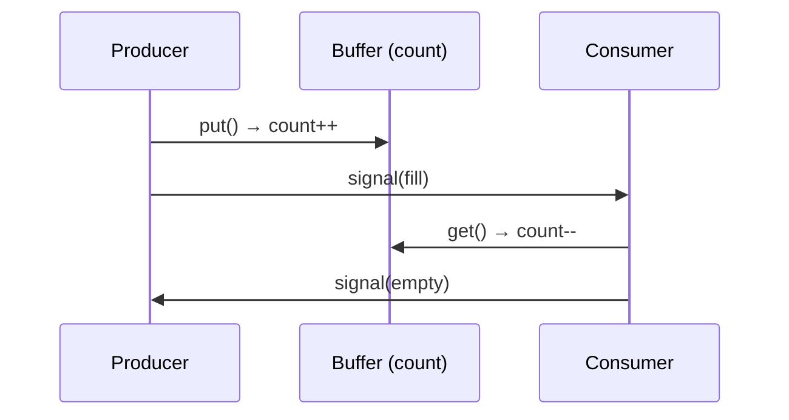

+++
date = '2026-02-02T10:00:00+09:00'
draft = false
title = '[OSTEP] Ch.30 - Condition Variables'
description = "OSTEP 동시성 파트 - Condition Variables 정리 노트"
tags = ["OS", "OSTEP", "Concurrency"]
categories = ["OS"]
series = ["OSTEP 정리"]
+++
## Crux (핵심 문제)
스레드가 특정 조건이 참이 될 때까지 기다려야 할 때, CPU를 낭비하지 않고 어떻게 효율적으로 대기하게 할 것인가?

## 배경 & 동기

Lock (Mutex)은 "임계 구역에 하나만 들어가게" 해준다. 그런데 "어떤 조건이 될 때까지 기다려야 한다"는 다른 문제다. 예: 부모 스레드가 자식 스레드 종료를 기다림.

**나쁜 해법 — 바쁜 대기(spin)**:
```c
while (done == 0) ;  // CPU 낭비, 에너지 낭비
```

필요한 것: 조건이 될 때까지 **잠들고**, 조건이 되면 **깨어나는** 메커니즘 → Condition Variable

## Mechanism (어떻게 동작하는가)

### Condition Variable 기본

```c
pthread_cond_t c = PTHREAD_COND_INITIALIZER;
pthread_mutex_t m = PTHREAD_MUTEX_INITIALIZER;
int done = 0;

// 대기하는 쪽
pthread_mutex_lock(&m);
while (done == 0)
    pthread_cond_wait(&c, &m);   // 락 해제 + 슬립 (원자적)
pthread_mutex_unlock(&m);        // 깨어나면 락 다시 잡은 상태

// 신호 보내는 쪽
pthread_mutex_lock(&m);
done = 1;
pthread_cond_signal(&c);         // 대기 스레드 하나 깨움
pthread_mutex_unlock(&m);
```

> [!important]
> `wait()`는 **락을 해제하고 잠드는 것을 원자적으로** 수행한다. 이 원자성이 없으면 신호를 놓치는 Race Condition이 생긴다.

### 왜 `while`이어야 하나? (`if` 안 되는 이유)

```c
// ❌ 틀린 패턴
if (done == 0)
    pthread_cond_wait(&c, &m);

// ✅ 올바른 패턴
while (done == 0)
    pthread_cond_wait(&c, &m);
```

**Spurious Wakeup**: 신호 없이 깨어나는 경우가 있음 (pthread 스펙 허용).
**Multiple Waiters**: 여러 스레드가 대기할 때 `broadcast`로 전부 깨우면, 깨어난 후 조건을 다시 확인해야 함.

→ 항상 `while`로 깨어난 뒤 조건을 재확인한다.

### 상태 변수(state variable)의 중요성

```c
// ❌ 상태 변수 없이 signal만 쓰면?
void thr_exit() {
    pthread_cond_signal(&c);   // 대기 중인 스레드가 없으면 신호 유실!
}
void thr_join() {
    pthread_cond_wait(&c, &m); // 영원히 못 깨어남
}
```

`done` 같은 상태 변수가 있어야 "내가 잠들기 전에 이미 조건이 됐는지"를 확인할 수 있다.

### Producer-Consumer (Bounded Buffer) 문제

생산자는 버퍼에 넣고, 소비자는 버퍼에서 꺼낸다. 버퍼가 꽉 차면 생산자 대기, 비면 소비자 대기.

**조건 변수 두 개 사용 (올바른 해법)**:
```c
pthread_cond_t empty, fill;  // 각각 다른 조건

void producer() {
    pthread_mutex_lock(&m);
    while (count == MAX)
        pthread_cond_wait(&empty, &m);  // "빈 슬롯" 대기
    put(value);
    count++;
    pthread_cond_signal(&fill);         // "채워짐" 신호
    pthread_mutex_unlock(&m);
}

void consumer() {
    pthread_mutex_lock(&m);
    while (count == 0)
        pthread_cond_wait(&fill, &m);   // "채워짐" 대기
    int v = get();
    count--;
    pthread_cond_signal(&empty);        // "빈 슬롯" 신호
    pthread_mutex_unlock(&m);
}
```



> [!important]
> 조건 변수를 하나만 쓰면 생산자가 생산자를 깨우는 상황이 생길 수 있다. **생산자용 조건(empty)과 소비자용 조건(fill)은 분리**해야 한다.

## Policy (왜 이렇게 설계했는가)

### signal vs broadcast
- `signal`: 대기 중인 스레드 중 **하나만** 깨움 — 효율적이나, 잘못 쓰면 누군가 영원히 못 깨어남
- `broadcast`: **전부** 깨움 — 안전하지만, 불필요한 깨움이 많아 성능 저하 가능

보수적인 설계라면 `broadcast`를 쓰되, 성능이 중요하면 조건 변수를 세분화해서 `signal` 사용.

### Condition Variable은 Memory가 없다
"나중에 신호를 보내도 됩니다" — Condition Variable은 과거 신호를 기억하지 않는다. 상태 변수(done, count 등)가 그 역할을 해야 한다.

## 내 정리

결국 이 챕터는 **"기다리는 방법"**을 Lock 위에 추가로 쌓은 것이다. Lock이 "누가 들어가느냐"를 제어한다면, Condition Variable은 "언제 들어가느냐"를 제어한다. 두 가지를 조합하면 Producer-Consumer 같은 복잡한 동기화 패턴도 깔끔하게 해결된다. 핵심 규칙: 항상 `while` + 상태 변수 + `wait`/`signal`을 쌍으로.

## 연결
- 이전: Ch.29 - Lock-based Concurrent Data Structures
- 다음: Ch.31 - Semaphores
- 관련 개념: Condition Variable, Lock (Mutex), Race Condition, Deadlock
