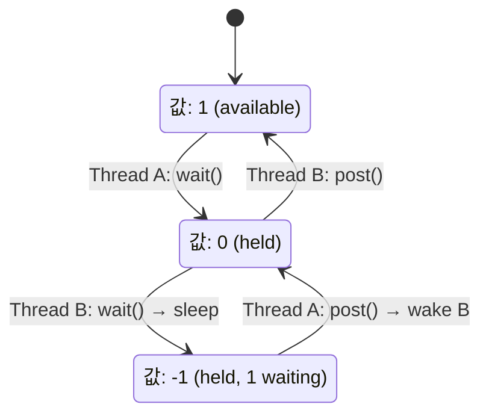

+++
date = '2026-02-05T10:00:00+09:00'
draft = false
title = '[OSTEP] Ch.31 - Semaphores'
description = "OSTEP 동시성 파트 - Semaphores 정리 노트"
tags = ["OS", "OSTEP", "Concurrency"]
categories = ["OS"]
series = ["OSTEP 정리"]
+++
## Crux (핵심 문제)
Lock과 Condition Variable 두 개를 따로 쓰는 대신, 하나의 원시 타입으로 모든 동기화를 처리할 수 있을까? Dijkstra의 세마포어는 어떻게 동작하며, 어떻게 활용하는가?

## 배경 & 동기

Condition Variable과 Lock (Mutex)을 배웠다. Semaphore는 Dijkstra가 제안한 단일 동기화 원시 타입으로, **Lock으로도 Condition Variable로도 쓸 수 있다**. 정수 값을 가진 객체 하나로 동기화의 상당 부분을 표현할 수 있다.

## Mechanism (어떻게 동작하는가)

### Semaphore 정의

```c
sem_t s;
sem_init(&s, 0, 1);  // 두 번째 인자 0: 프로세스 내 공유, 세 번째: 초깃값

int sem_wait(sem_t *s) {
    s->value -= 1;           // 값 감소
    if (s->value < 0) sleep; // 음수면 잠들기
}

int sem_post(sem_t *s) {
    s->value += 1;           // 값 증가
    if (waiting) wake one;   // 대기자 있으면 하나 깨우기
}
```

- 값이 **음수**이면 그 절댓값이 대기 중인 스레드 수
- `wait` = P (네덜란드어 probeer/prolaag), `post` = V (verhoog)

### 1. Binary Semaphore — Lock으로 사용

초깃값 **1**로 설정:

```c
sem_t m;
sem_init(&m, 0, 1);

sem_wait(&m);    // 1→0: 획득 성공 (다음 스레드는 -1→ 잠듦)
// critical section
sem_post(&m);    // 0→1 (또는 대기자 깨움)
```



### 2. Ordering Semaphore — Condition Variable로 사용

초깃값 **0**으로 설정:

```c
sem_t s;
sem_init(&s, 0, 0);  // 부모가 먼저 wait() 호출 시 즉시 잠듦

void *child(void *arg) {
    printf("child\n");
    sem_post(&s);   // 0→1, 또는 대기 부모 깨움
    return NULL;
}

int main() {
    Pthread_create(&c, NULL, child, NULL);
    sem_wait(&s);   // 0→-1 → 잠듦 (또는 자식이 먼저 하면 0→1인 상태를 봐서 즉시 통과)
    printf("parent: end\n");
}
```

> [!important]
> 초깃값 0의 세마포어는 "자식이 먼저 끝나도 부모가 기다리지 않아도 됨"을 보장한다. 상태를 내재적으로 기억하기 때문.

### 3. Producer-Consumer — Bounded Buffer

```c
sem_t empty, full, mutex;
sem_init(&empty, 0, MAX);  // 빈 슬롯 수
sem_init(&full,  0, 0);    // 채워진 슬롯 수
sem_init(&mutex, 0, 1);    // 버퍼 접근 mutual exclusion

void producer() {
    sem_wait(&empty);    // 빈 슬롯 기다림
    sem_wait(&mutex);    // 버퍼 접근 락
    put(value);
    sem_post(&mutex);
    sem_post(&full);     // 채워진 슬롯 +1
}

void consumer() {
    sem_wait(&full);     // 채워진 슬롯 기다림
    sem_wait(&mutex);
    int v = get();
    sem_post(&mutex);
    sem_post(&empty);    // 빈 슬롯 +1
}
```

> [!important]
> `mutex` wait를 `empty`/`full` wait **안쪽**에 둬야 한다. 반대 순서면 Deadlock! (생산자가 mutex 잡고 empty 기다리는데, 소비자가 mutex 못 잡아서 full을 못 올려주는 상황)

### 4. Reader-Writer Lock

- 여러 Reader는 동시에 읽을 수 있음
- Writer는 독점 접근

```c
// readers 수를 세마포어 + 카운터로 관리
// 첫 번째 reader가 writelock 잡음, 마지막 reader가 해제
```

**문제**: Reader가 계속 오면 Writer는 Starvation. 공정성을 위한 추가 로직 필요.

### Semaphore로 Lock/CV 구현 가능?

Lock과 Condition Variable로 Semaphore를 구현할 수 있다 (Zemaphore):

```c
typedef struct {
    int value;
    pthread_cond_t cond;
    pthread_mutex_t lock;
} Zem_t;
```

반대도 가능하지만, Semaphore로 CV를 완벽히 구현하기는 트릭키함 (특히 signal-before-wait 처리).

## Policy (왜 이렇게 설계했는가)

### Lock + CV vs Semaphore
| 비교 | Lock + CV | Semaphore |
|------|-----------|-----------|
| 표현력 | 명시적 (의도 분리) | 단일 원시 타입 |
| 이해 난이도 | 초깃값 선택 어려울 수 있음 | 초깃값 직관적 |
| 버그 위험 | 상태 변수 빠뜨리면 신호 유실 | 값이 상태를 기억함 |
| 실용성 | pthread가 기본 제공 | POSIX에도 있지만 덜 씀 |

현대 코드베이스는 Lock + Condition Variable을 더 많이 쓴다. Semaphore는 "개수 제한"이 중요한 경우(rate limiting, connection pool 등)에 유용.

## 내 정리

결국 세마포어는 **정수 하나로 다 되는 동기화 도구**다. 초깃값이 1이면 Lock, 0이면 Condition Variable 역할, N이면 N개 허용 리소스 관리. 하지만 초깃값을 잘못 설정하면 조용히 망가지기 때문에, 의도를 명확히 해야 한다. Producer-Consumer처럼 "개수"를 세야 할 때 세마포어가 특히 자연스럽다.

## 연결
- 이전: Ch.30 - Condition Variables
- 다음: Ch.32 - Common Concurrency Problems
- 관련 개념: Semaphore, Lock (Mutex), Condition Variable, Deadlock, Race Condition
