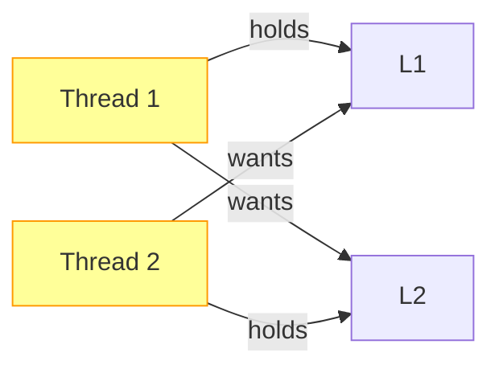

+++
date = '2026-02-07T10:00:00+09:00'
draft = false
title = '[OSTEP] Ch.32 - Common Concurrency Problems'
description = "OSTEP 동시성 파트 - Common Concurrency Problems 정리 노트"
tags = ["OS", "OSTEP", "Concurrency"]
categories = ["OS"]
series = ["OSTEP 정리"]
+++
## Crux (핵심 문제)
실제 코드베이스에서 동시성 버그는 어떤 패턴으로 나타나는가? 어떻게 예방하고 처리할 것인가?

## 배경 & 동기

Lu et al.의 연구: MySQL, Apache, Mozilla, OpenOffice에서 실제 발견·수정된 버그 105개 분석.

| 애플리케이션 | Non-Deadlock | Deadlock |
|-------------|-------------|---------|
| MySQL | 14 | 9 |
| Apache | 13 | 4 |
| Mozilla | 41 | 16 |
| OpenOffice | 6 | 2 |
| **합계** | **74** | **31** |

Non-Deadlock(74개)이 훨씬 많다. 하지만 Deadlock도 무시 못 한다.

## Mechanism (어떻게 동작하는가)

### Part 1: Non-Deadlock 버그

#### 1-A. Atomicity Violation (원자성 위반)

**실제 MySQL 버그**:
```c
// Thread 1
if (thd->proc_info) {
    fputs(thd->proc_info, ...);  // NULL 체크 후 사용
}

// Thread 2
thd->proc_info = NULL;  // 중간에 NULL로!
```

Thread 1이 `if` 체크 통과 후, Thread 2가 `NULL`로 바꾸면 → `fputs`에서 NULL 역참조 → 크래시.

**정의**: "원자적이어야 할 코드 영역이 실제로 원자적으로 실행되지 않음"

**수정**: 락으로 묶기
```c
pthread_mutex_lock(&proc_info_lock);
if (thd->proc_info) fputs(thd->proc_info, ...);
pthread_mutex_unlock(&proc_info_lock);
```

#### 1-B. Order Violation (순서 위반)

**실제 Mozilla 버그**:
```c
// Thread 1 (초기화)
void init() {
    mThread = PR_CreateThread(mMain, ...);
}

// Thread 2 (사용)
void mMain() {
    mState = mThread->State;  // mThread가 초기화됐다고 가정!
}
```

Thread 2가 Thread 1보다 먼저 실행되면 `mThread`가 NULL → 크래시.

**정의**: "A가 B보다 먼저 실행되어야 하는데, 실행 순서가 보장되지 않음"

**수정**: Condition Variable로 순서 강제
```c
// Thread 1
mThread = PR_CreateThread(mMain, ...);
pthread_mutex_lock(&mtLock);
mtInit = 1;
pthread_cond_signal(&mtCond);
pthread_mutex_unlock(&mtLock);

// Thread 2
pthread_mutex_lock(&mtLock);
while (mtInit == 0)
    pthread_cond_wait(&mtCond, &mtLock);
pthread_mutex_unlock(&mtLock);
mState = mThread->State;  // 이제 안전
```

> [!important]
> Lu et al. 연구에서 Non-Deadlock 버그의 **97%가 Atomicity 또는 Order Violation**이었다. 이 두 패턴만 조심해도 대부분의 동시성 버그를 막을 수 있다.

### Part 2: Deadlock 버그

Deadlock은 두 스레드가 서로가 잡고 있는 락을 기다릴 때 발생한다.

```c
// Thread 1       Thread 2
lock(L1);         lock(L2);
lock(L2);         lock(L1);  // 서로 기다림 → 교착
```



**Deadlock 4가지 필요 조건** (Coffman Conditions):
1. **Mutual Exclusion** — 락은 한 번에 하나만
2. **Hold-and-Wait** — 락을 들고 다른 락을 기다림
3. **No Preemption** — 락을 강제로 빼앗을 수 없음
4. **Circular Wait** — 스레드 간 원형 대기

→ 이 4가지 중 **하나만 깨도** Deadlock 방지 가능.

#### 예방 전략 1: Circular Wait 제거 — 락 순서 강제

```c
// 항상 L1 → L2 순으로 획득 (절대 역순으로 잡지 않음)
lock(L1); lock(L2);
```

트릭: 락 주소(포인터 값)로 순서 결정
```c
if (m1 > m2) { lock(m1); lock(m2); }
else          { lock(m2); lock(m1); }
```

> [!important]
> 락 순서는 **컨벤션**이다. 프로그래머 한 명이 어기면 끝. 따라서 코드 리뷰와 문서화가 중요.

#### 예방 전략 2: Hold-and-Wait 제거 — 한 번에 모든 락 획득

```c
lock(prevention);   // 메타-락으로 원자적 획득 보장
lock(L1);
lock(L2);
unlock(prevention);
```

단점: 어떤 락이 필요한지 미리 알아야 함. 캡슐화와 충돌.

#### 예방 전략 3: No Preemption 제거 — trylock 사용

```c
top:
lock(L1);
if (trylock(L2) == FAILED) {
    unlock(L1);
    goto top;   // 되돌아가서 재시도
}
```

단점: **Livelock** 가능 (두 스레드가 동시에 실패하고 동시에 재시도, 반복).

#### 예방 전략 4: Mutual Exclusion 제거 — Lock-Free

Compare-and-Swap (CAS) 같은 하드웨어 원자 명령으로 락 없이 자료구조 업데이트.
- 복잡하지만 데드락 원천 차단
- 실용적인 경우: atomic counter, lock-free queue 등

#### 회피 (Avoidance): Banker's Algorithm

스레드가 필요한 락 목록을 미리 선언하고, 데드락 발생 가능한 상태로의 진입을 거부.
- 실용성 낮음 (모든 자원 수요 사전 파악 어려움)

#### 감지 & 복구 (Detect & Recover)

데드락을 주기적으로 탐지(그래프 순환 탐색)하고, 발생 시 스레드 하나를 강제 종료하거나 롤백.
- 데이터베이스 시스템이 주로 사용하는 방식

## Policy (왜 이렇게 설계했는가)

### 현실적인 접근법

| 전략 | 장점 | 단점 |
|------|------|------|
| 락 순서 | 단순, 효과적 | 컨벤션 의존, 대규모 코드에서 관리 어려움 |
| trylock | 유연함 | Livelock 가능 |
| Lock-Free | 데드락 불가능 | 구현 복잡 |
| Detect & Recover | 유연함 | 오버헤드, 복구 복잡 |

> [!important]
> 실무에서 가장 흔한 접근: **락 순서 강제** + **코드 리뷰** + **Deadlock 탐지 툴(ThreadSanitizer 등)**

## 내 정리

결국 이 챕터는 동시성 버그의 분류와 예방을 다룬다. Non-Deadlock 버그(원자성/순서 위반)는 "락과 Condition Variable로 의도를 명시"하면 대부분 해결된다. Deadlock은 4가지 조건 중 하나를 깨는 방식으로 예방하는데, 가장 현실적인 방법은 **락 획득 순서를 일관되게 유지**하는 것이다.

## 연결
- 이전: Ch.31 - Semaphores
- 다음: Ch.33 - Event-based Concurrency
- 관련 개념: Deadlock, Race Condition, Lock (Mutex), Atomic Operation, Compare-and-Swap (CAS), Critical Section
