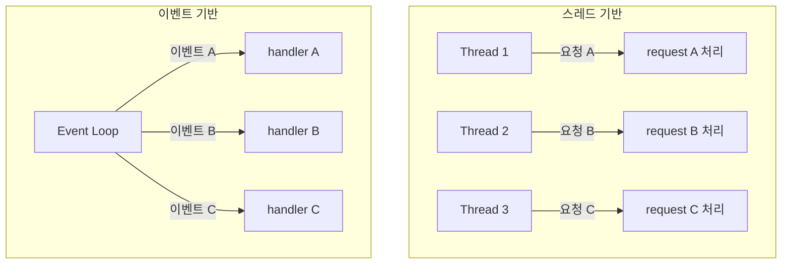

+++
date = '2026-02-09T10:00:00+09:00'
draft = false
title = '[OSTEP] Ch.33 - Event-based Concurrency'
description = "OSTEP 동시성 파트 - Event-based Concurrency 정리 노트"
tags = ["OS", "OSTEP", "Concurrency"]
categories = ["OS"]
series = ["OSTEP 정리"]
+++
## Crux (핵심 문제)
스레드 없이도 동시성을 처리할 수 있는가? 이벤트 기반 서버는 어떻게 여러 요청을 동시에 처리하며, 블로킹 I/O 문제는 어떻게 해결하는가?

## 배경 & 동기

스레드 기반 프로그래밍의 문제점:
1. **복잡성** — 락, 데드락, 레이스 컨디션 등 온갖 버그
2. **제어권 부재** — OS 스케줄러가 임의로 스레드를 전환

대안: **이벤트 기반 동시성(Event-based Concurrency)** — 단일 스레드로 이벤트 루프를 돌리며 여러 요청 처리. Node.js, GUI 프레임워크, 고성능 웹서버(nginx)의 근간.

## Mechanism (어떻게 동작하는가)

### 이벤트 루프 (Event Loop)

```c
while (1) {
    events = getEvents();       // 어떤 이벤트가 왔나?
    for (e in events)
        processEvent(e);        // 하나씩 처리
}
```

핵심: **한 번에 하나의 이벤트만 처리**. 스케줄링 결정권이 OS가 아닌 **프로그래머**에게 있다.

### select() / poll() — 이벤트 감지

어떤 파일 디스크립터(네트워크 소켓, 파일 등)에 데이터가 준비됐는지 확인:

```c
int select(int nfds,
           fd_set *readfds,
           fd_set *writefds,
           fd_set *errorfds,
           struct timeval *timeout);
```

사용 패턴:
```c
while (1) {
    fd_set readFDs;
    FD_ZERO(&readFDs);
    for (fd = minFD; fd < maxFD; fd++)
        FD_SET(fd, &readFDs);

    int rc = select(maxFD+1, &readFDs, NULL, NULL, NULL);

    for (fd = minFD; fd < maxFD; fd++)
        if (FD_ISSET(fd, &readFDs))
            processFD(fd);   // 읽을 데이터가 있는 fd만 처리
}
```

> [!important]
> `select()`는 **어떤 fd에 데이터가 준비됐는지** 알려줄 뿐, 데이터를 읽지는 않는다. 준비된 fd에 대해서만 읽기 호출 → 블로킹 없음.

### 왜 락이 필요 없나? (단일 CPU 기준)

단일 스레드 이벤트 루프에서는 **한 번에 하나의 이벤트 핸들러만 실행**된다. 인터럽트로 다른 스레드로 전환될 일이 없으므로, Critical Section 자체가 성립하지 않는다. → 락 불필요, Race Condition 없음.

### 문제: Blocking System Call

이벤트 핸들러 안에서 블로킹 I/O 호출이 발생하면?
```c
// ❌ 이벤트 핸들러 안에서 이런 코드 → 전체 서버 블록!
int rc = read(fd, buf, size);  // 디스크 I/O 끝날 때까지 대기
```

이벤트 루프 = 단일 스레드 → 블로킹이 발생하면 **모든 이벤트 처리 중단**.

**황금 규칙**: 이벤트 기반 서버에서 **블로킹 호출은 절대 금지**.

### 해법: Asynchronous I/O (AIO)

```c
// I/O 요청 발행 — 즉시 리턴
struct aiocb aio;
aio.aio_fildes = fd;
aio.aio_offset = 0;
aio.aio_buf = buffer;
aio.aio_nbytes = size;
aio_read(&aio);  // 바로 리턴, I/O는 백그라운드에서 진행

// 나중에 완료 여부 확인
int rc = aio_error(&aio);
// rc == 0: 완료, EINPROGRESS: 진행 중
```

또는 UNIX 시그널로 완료 통지 받기 (polling 대신 interrupt 방식).

### 상태 관리 문제 (Manual Stack Management)

스레드 기반에서는 스택이 상태를 자동 유지:
```c
// 스레드: read → write 순서가 스택에 자연히 저장됨
int rc = read(fd, buf, size);
write(sd, buf, size);  // fd, sd, buf 모두 스택에 있음
```

이벤트 기반에서는 AIO 후 이벤트 핸들러가 바뀌므로 **상태를 명시적으로 저장**해야:
```c
// AIO read 발행 시 (sd = socket descriptor)를 별도 저장
hash_table_insert(fd, sd);  // fd → sd 매핑 기록

// 나중에 read 완료 이벤트 도착 시
sd = hash_table_lookup(fd); // 이전 상태 복원
write(sd, buf, size);
```

이를 **Continuation**이라 부른다 — 처리를 이어가기 위한 "나머지 컨텍스트"를 명시적으로 전달.

> [!example]
> Node.js의 callback, Promise, async/await 패턴이 모두 이 "continuation"을 추상화한 것이다.

## Policy (왜 이렇게 설계했는가)

### 이벤트 기반 vs 스레드 기반



| 비교 | 스레드 기반 | 이벤트 기반 |
|------|-----------|-----------|
| 락 필요 | O | X (단일 CPU) |
| 블로킹 I/O | 자연스러움 | AIO 필요 |
| 상태 관리 | 스택이 자동 | Continuation 수동 관리 |
| 멀티코어 활용 | 자연스러움 | 추가 작업 필요 |
| 디버깅 | 어려움 | 비교적 쉬움 (결정적) |

### 이벤트 기반의 한계

1. **멀티코어 환경**: 여러 CPU를 쓰려면 결국 여러 이벤트 루프 → 동기화 문제 재발
2. **Page Fault**: 암묵적 블로킹 → 이벤트 루프 전체 중단
3. **AIO 복잡성**: 플랫폼마다 API가 달라 이식성 어려움
4. **코드 가독성**: Callback hell, Continuation 관리 복잡

> [!important]
> 이벤트 기반이 만능이 아니다. I/O 집약적이고 CPU 연산이 가벼운 서버(Node.js 웹서버)에 적합하고, CPU 집약적이거나 블로킹 I/O가 많은 경우엔 스레드가 낫다.

## 내 정리

결국 이 챕터는 **"스레드 없이도 동시성 서버를 만들 수 있다"**는 아이디어를 설명한다. `select()`로 준비된 이벤트만 골라 처리하면 단일 스레드로도 수천 개의 연결을 동시에 다룰 수 있다. 하지만 블로킹 I/O 문제는 AIO로 해결해야 하고, 상태는 Continuation으로 수동 관리해야 한다. 현대 Node.js, nginx 등이 이 방식을 쓴다. 락이 없다는 단순함이 매력이지만, 멀티코어 환경에서 결국 동기화 문제가 돌아온다.

## 연결
- 이전: Ch.32 - Common Concurrency Problems
- 다음: Ch.36 - I/O Devices (Persistence 파트 시작)
- 관련 개념: Race Condition, Critical Section, Lock (Mutex)
