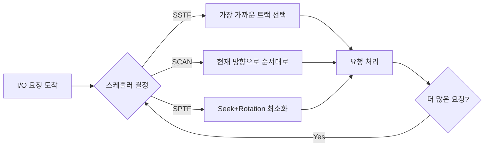

+++
date = '2026-02-14T10:00:00+09:00'
draft = false
title = '[OSTEP] Ch.37 - Hard Disk Drives'
description = "OSTEP 영속성 파트 - Hard Disk Drives 정리 노트"
tags = ["OS", "OSTEP", "Persistence"]
categories = ["OS"]
series = ["OSTEP 정리"]
+++
## Crux (핵심 문제)
HDD는 어떻게 데이터를 저장하고 접근하는가? OS는 어떻게 디스크 I/O를 효율적으로 스케줄링할 수 있는가?

## 배경 & 동기

파일 시스템은 HDD 위에서 동작한다. 그러면 HDD가 어떻게 작동하는지 모르고 파일 시스템을 이해하는 건 모래 위에 집 짓는 격. HDD의 물리적 특성이 OS 설계에 직접 영향을 미친다.

## Mechanism (어떻게 동작하는가)

### HDD 인터페이스

외부에서 보면 단순하다: **0번부터 N-1번까지 번호 붙은 512-byte 섹터의 배열**.

- 단일 512-byte 쓰기만 **원자적(atomic)** 보장
- 더 큰 쓰기(예: 4KB)는 중간에 전원이 나가면 일부만 기록될 수 있음 → **torn write** 문제

"unwritten contract": 가까운 블록끼리의 접근이 먼 블록 접근보다 빠름. 순차 접근이 랜덤 접근보다 훨씬 빠름.

### HDD 물리 구조

```
플래터(Platter)    — 자성 코팅된 원형 디스크, 여러 장
표면(Surface)      — 플래터의 양면, 각면에 데이터 기록
트랙(Track)        — 표면의 동심원, 수만 개
섹터(Sector)       — 트랙 위의 단위 블록 (512 bytes)
스핀들(Spindle)    — 모터로 플래터 회전, 7,200~15,000 RPM
헤드(Disk Head)    — 자기 읽기/쓰기 소자, 표면당 1개
암(Disk Arm)       — 헤드를 원하는 트랙으로 이동
```

```
         [표면 단면도]
         ┌─────────────────────┐
         │  outer track (0-11) │
         │  ┌─────────────┐    │
         │  │ middle track│    │
         │  │ ┌─────────┐ │    │
         │  │ │  inner  │ │    │
         │  │ │  track  │ │    │
         │  │ └─────────┘ │    │
         │  └─────────────┘    │
         └─────────────────────┘
              ↑ 헤드가 암에 달려 이동
```

### I/O Time = Seek + Rotation + Transfer

디스크에서 데이터를 읽는 시간은 세 단계:

```
T_I/O = T_seek + T_rotation + T_transfer
```

| 단계 | 내용 | 전형적 시간 |
|------|------|-------------|
| **Seek** | 헤드를 원하는 트랙으로 이동 (가속→이동→감속→정착) | ~4~9 ms |
| **Rotation** | 원하는 섹터가 헤드 밑으로 올 때까지 기다림 | 평균 = RPM의 절반 회전 |
| **Transfer** | 실제 데이터 읽기/쓰기 | ~30 μs (작은 블록) |

> [!important]
> **Seek와 Rotation이 거의 모든 시간을 차지한다.** Transfer는 무시할 수준.
> 10K RPM 디스크 → 1회전 = 6 ms → 평균 회전 대기 = 3 ms.

**Random vs Sequential 성능 차이** (Cheetah 15K.5 기준):
- Random 4KB: ~0.66 MB/s
- Sequential: ~125 MB/s
- 차이: **약 200배**

이게 바로 "무조건 순차 접근이 좋다"는 원칙의 근거.

### 디스크 내부 기법들

**Track Skew**: 트랙을 넘어가는 순차 읽기에서, 헤드가 다음 트랙으로 이동하는 동안 원하는 섹터가 지나치지 않도록 옆 트랙 섹터를 살짝 엇갈려 배치.

**Multi-zone**: 바깥 트랙은 안쪽보다 공간이 많아 더 많은 섹터를 가짐. → 외부 트랙이 내부보다 전송률이 높다.

**Track Buffer (Cache)**: 디스크 내부 메모리(8~16 MB). 한 트랙 읽을 때 전체 트랙을 캐싱해서 다음 요청 빠르게 응답.

> [!important]
> **Write-back vs Write-through 캐시**:
> - Write-back: 메모리에 쓰면 완료 보고 → 더 빠르지만 전원 꺼지면 데이터 손실 위험
> - Write-through: 실제 디스크에 써야 완료 보고 → 느리지만 안전
> 파일 시스템 쓰기 순서에 의존하는 경우 Write-back이 위험할 수 있다 → Ch.42 참조

## Policy (왜 이렇게 설계했는가) — 디스크 스케줄링

여러 I/O 요청이 쌓이면 어떤 순서로 처리할까? 목표는 **SJF처럼 가장 짧은 것부터**.

### SSTF (Shortest Seek Time First)

현재 헤드 위치에서 가장 가까운 트랙 먼저 처리.

**문제: Starvation** — 가까운 트랙에 요청이 계속 오면 먼 트랙 요청은 영원히 대기.

### SCAN / Elevator Algorithm

엘리베이터처럼 헤드가 한 방향(외부→내부)으로 쭉 이동하며 처리, 끝에 닿으면 반대 방향으로. Starvation 해결.

**변형들:**
- **F-SCAN**: sweep 중에 새 요청을 큐에 모아두고 다음 sweep에서 처리 → 먼 요청 기아 방지
- **C-SCAN**: 한 방향(외부→내부)만 처리하고 리셋. 중간 트랙이 두 번씩 처리되는 불공평 해소

**SCAN의 한계**: Rotation을 고려하지 않음. 가까운 트랙이라도 헤드 바로 지나쳐 거의 한 바퀴를 기다려야 할 수 있음.

### SPTF (Shortest Positioning Time First)

Seek + Rotation을 **둘 다 고려**해서 가장 빨리 접근 가능한 섹터 우선.

```
헤드가 섹터 30 위 (inner track)
요청: 섹터 16 (middle track), 섹터 8 (outer track)

Seek만 보면 → 16이 더 가까움
But! Rotation 고려하면 → 8이 더 빨리 닿을 수도 있음
```

SPTF가 이론적으로 최적이지만, OS는 헤드 위치나 트랙 경계를 정확히 모름. 그래서 **디스크 내부 컨트롤러**가 SPTF를 수행하고, OS는 여러 요청을 한꺼번에 넘겨준다(예: 16개씩).

### I/O Merging

블록 33과 34 요청이 따로 오면 → 하나의 2-블록 요청으로 병합. 디스크 요청 수 감소 → 오버헤드 감소.

### Work-conserving vs Anticipatory

- **Work-conserving**: 요청이 오면 즉시 처리
- **Anticipatory**: 잠깐 기다리면 "더 좋은" 요청이 올 수 있음 → 전체 효율 향상 가능



## 내 정리

결국 HDD 성능은 **기계적 움직임(Seek + Rotation)이 지배**한다. 이를 최소화하는 게 전부.
- **순차 접근 = 좋음**: Seek, Rotation 최소화
- **랜덤 접근 = 나쁨**: 매번 새로운 Seek + Rotation
- **스케줄러의 역할**: 여러 요청을 영리하게 재정렬해서 불필요한 헤드 이동 줄이기

파일 시스템이 "연속된 블록에 데이터를 저장하라"고 신경 쓰는 이유가 여기 있다. 하드웨어의 특성을 알아야 그 위의 소프트웨어 설계가 이해된다.

## 연결
- 이전: Ch.36 - I_O Devices
- 다음: Ch.38 - RAIDs
- 관련 개념: Device Driver, File System
