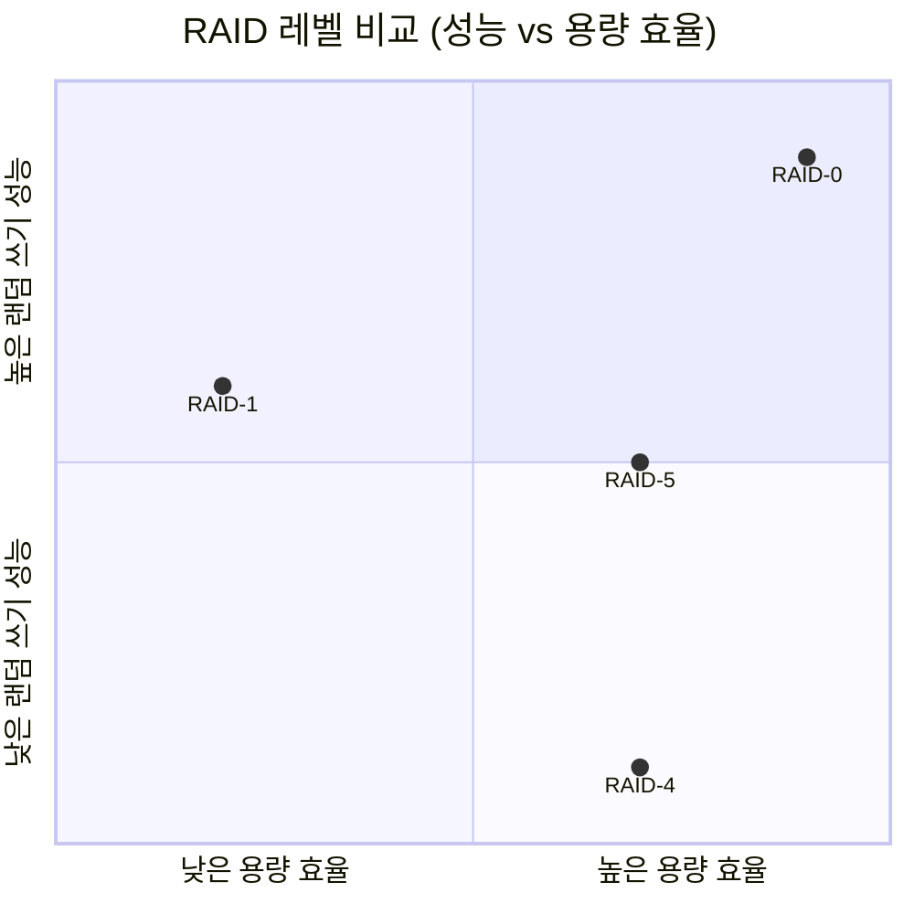

+++
date = '2026-02-16T10:00:00+09:00'
draft = false
title = '[OSTEP] Ch.38 - RAIDs'
description = "OSTEP 영속성 파트 - RAIDs 정리 노트"
tags = ["OS", "OSTEP", "Persistence"]
categories = ["OS"]
series = ["OSTEP 정리"]
+++
## Crux (핵심 문제)
단일 디스크의 한계(느리고, 작고, 불안정)를 어떻게 극복할 것인가? 여러 디스크를 묶어 더 크고, 빠르고, 신뢰할 수 있는 스토리지를 만들 수 있는가?

## 배경 & 동기

단일 HDD는 세 가지 불만이 있다:
1. **느리다** — 랜덤 I/O가 특히 끔찍
2. **작다** — 데이터는 계속 늘어남
3. **불안정하다** — 하나 죽으면 데이터 전부 소실

RAID는 1988년 UC Berkeley(Patterson, Gibson, Katz)가 제안. 핵심 아이디어: **여러 개의 싼 디스크를 묶어 하나의 크고 빠르고 신뢰할 수 있는 디스크처럼 보이게 한다.**

> [!important]
> **투명성(Transparency)이 핵심**: RAID는 OS와 파일 시스템에게 그냥 "큰 디스크" 하나로 보인다. 소프트웨어 변경 없이 기존 SCSI 디스크를 RAID로 교체 가능 → 배포가 쉬웠기 때문에 성공했다.

## Mechanism (어떻게 동작하는가)

### RAID 평가 기준 3가지

모든 RAID 레벨을 이 세 축으로 비교한다:

| 축 | 질문 |
|----|------|
| **Capacity** | N개 디스크(각 B블록) 중 실제 쓸 수 있는 용량은? |
| **Reliability** | 몇 개 디스크 장애까지 데이터를 보호하는가? |
| **Performance** | Sequential/Random, Read/Write 처리량은? |

**Fault Model**: Fail-Stop 모델 가정 — 디스크는 완전히 작동하거나, 완전히 고장난다(중간이 없다). 고장은 즉시 감지된다.

---

### RAID-0: Striping (스트라이핑)

**아이디어**: 블록을 디스크에 라운드로빈으로 분산.

```
Disk 0  Disk 1  Disk 2  Disk 3
  0       1       2       3      ← Stripe 0
  4       5       6       7      ← Stripe 1
  8       9      10      11      ← Stripe 2
```

논리 블록 A → `디스크 = A % N`, `오프셋 = A / N`

**Chunk Size**: 몇 블록씩 묶어서 한 디스크에 할당할지.
- 작은 청크 → 파일이 여러 디스크에 분산 → 병렬성 높음, 하지만 positioning 오버헤드 증가
- 큰 청크 → 파일이 한 디스크에 집중 → 디스크 간 병렬성 낮음, positioning 오버헤드 감소

**평가:**

| | RAID-0 |
|-|--------|
| Capacity | N·B (최대) |
| Reliability | **0** — 디스크 1개 죽으면 전체 소실 |
| Seq Read | N·S |
| Seq Write | N·S |
| Rand Read | N·R |
| Rand Write | N·R |

순수한 성능 상한선. 신뢰성 없음.

---

### RAID-1: Mirroring (미러링)

**아이디어**: 모든 블록을 2개의 디스크에 똑같이 복사.

```
Disk 0  Disk 1  Disk 2  Disk 3
  0       0       1       1      ← 0,1이 미러 쌍, 2,3이 미러 쌍
  2       2       3       3
  4       4       5       5
```

- **읽기**: 두 복사본 중 어디서든 읽을 수 있음 → 유연성
- **쓰기**: 두 디스크 모두 업데이트해야 함 → 병렬로 가능하지만 더 오래 걸림

> [!important]
> **Consistent-Update Problem**: 쓰기 도중 전원이 나가면 두 미러 복사본이 불일치 상태가 된다. 해결책: Non-volatile RAM에 write-ahead log → 크래시 후 복구 가능.

**평가:**

| | RAID-1 |
|-|--------|
| Capacity | (N·B)/2 — 절반만 실제 사용 |
| Reliability | 1개 확실히 보호, 운 좋으면 N/2개까지 |
| Seq Read/Write | (N/2)·S |
| Rand Read | N·R (두 복사본 활용 가능) |
| Rand Write | (N/2)·R |

랜덤 I/O 성능과 신뢰성은 좋지만, 용량이 절반으로 줄어드는 게 단점.

---

### RAID-4: Parity (패리티)

**아이디어**: 미러링 대신 XOR 패리티 블록으로 중복성 확보 → 용량 효율 개선.

```
Disk 0  Disk 1  Disk 2  Disk 3  Disk 4(Parity)
  0       1       2       3        P0 = XOR(0,1,2,3)
  4       5       6       7        P1
```

**XOR 패리티 원리**:
- 각 스트라이프의 XOR값을 패리티 블록에 저장
- 디스크 하나 장애 시: 나머지 + 패리티 XOR → 잃어버린 값 복구

```
C0  C1  C2  C3  P
0   0   1   1   0  → 1이 짝수 개, P=0
0   1   0   0   1  → 1이 홀수 개, P=1
C2 장애 시: XOR(C0, C1, C3, P) = XOR(1, 0, 0, 1) = 0... 아니 1 재구성
```

**소규모 랜덤 쓰기 (Subtractive Parity)**:
블록 하나만 업데이트하면 패리티도 다시 계산해야 한다:

```
P_new = (C_old ⊕ C_new) ⊕ P_old
```

이 연산에 필요한 I/O: old 데이터 읽기 + old 패리티 읽기 + new 데이터 쓰기 + new 패리티 쓰기 = **4 I/O**

> [!important]
> **Small-Write Problem**: 랜덤 소규모 쓰기가 동시에 여러 개 들어오면, 모두 패리티 디스크에 읽기+쓰기가 집중된다. 패리티 디스크가 **병목(bottleneck)** → 병렬화 불가능.

**평가:**

| | RAID-4 |
|-|--------|
| Capacity | (N-1)·B |
| Reliability | 1개 보호 |
| Seq Read | (N-1)·S |
| Seq Write | (N-1)·S |
| Rand Read | (N-1)·R |
| Rand Write | **R/2** (패리티 디스크 병목) |

---

### RAID-5: Rotating Parity (패리티 로테이션)

**아이디어**: 패리티 블록을 모든 디스크에 골고루 분산 → 패리티 디스크 병목 해소.

```
Disk 0  Disk 1  Disk 2  Disk 3  Disk 4
  0       1       2       3       P0
  5       6       7       P3       4
 10      11       P2       8       9
 15       P1      12      13      14
  P4     16      17      18      19
```

이제 랜덤 쓰기가 서로 다른 패리티 블록을 건드리면 **병렬 처리 가능**.

**평가:**

| | RAID-5 |
|-|--------|
| Capacity | (N-1)·B |
| Reliability | 1개 보호 |
| Seq Read | (N-1)·S |
| Seq Write | (N-1)·S |
| Rand Read | **N·R** (모든 디스크 활용) |
| Rand Write | **(N/4)·R** — 여전히 4 I/O/write이지만 병렬화됨 |

## Policy (왜 이렇게 설계했는가) — RAID 레벨 비교



| RAID | 용량 | 신뢰성 | 랜덤Write | 언제 쓰나 |
|------|------|--------|-----------|-----------|
| 0 | N·B | 없음 | N·R | 성능만 중요, 신뢰성 불필요 |
| 1 | N·B/2 | 1~N/2 | N/2·R | 랜덤 I/O + 신뢰성, 비용 감수 |
| 4 | (N-1)·B | 1 | R/2 | Sequential 위주, 소규모 쓰기 없을 때 |
| 5 | (N-1)·B | 1 | N/4·R | **범용 (현실에서 가장 많이 씀)** |

> [!important]
> **RAID-4 vs RAID-5**: RAID-4는 항상 Sequential write만 한다면 RAID-5와 성능 동일하고 구현 더 단순. 실제로 랜덤 쓰기가 없는 환경(예: 특정 NAS 어플라이언스)에선 RAID-4를 쓰기도 함. 그 외엔 RAID-5가 RAID-4를 완전히 대체.

### Write Latency 차이

| RAID | Read Latency | Write Latency |
|------|-------------|---------------|
| 0, 1 | T | T |
| 4, 5 | T | **2T** (read-modify-write) |

RAID-4/5 쓰기는 항상 read-old + read-parity + write-new + write-parity = 4 I/O.

## 내 정리

결국 RAID는 **"여러 싼 디스크 = 하나의 비싼 큰 디스크"** 환상을 만드는 기술이다.

세 축(용량, 신뢰성, 성능)에서 **모두 최고인 RAID는 없다**. Trade-off만 있다:
- 신뢰성 원하면 용량/성능 포기 (RAID-1)
- 용량·신뢰성 원하면 랜덤 쓰기 성능 포기 (RAID-5)
- 성능 최대화하면 신뢰성 없음 (RAID-0)

현실에서 **RAID-5가 가장 범용적**으로 쓰이는 건 용량 효율과 신뢰성의 균형 덕분. 단, SSD가 등장하면서 HDD 기반 RAID의 중요성은 점점 줄어들고 있다.

## 연결
- 이전: Ch.37 - Hard Disk Drives
- 다음: Ch.39 - Files and Directories
- 관련 개념: RAID
