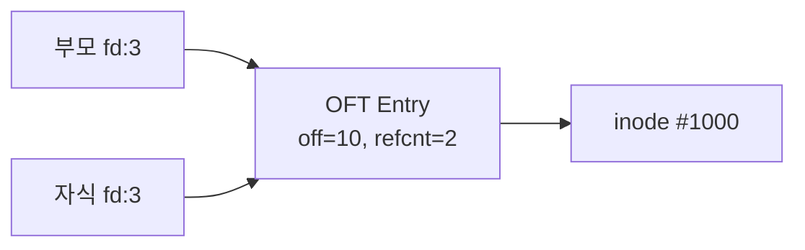

+++
date = '2026-02-19T10:00:00+09:00'
draft = false
title = '[OSTEP] Ch.39 - Files and Directories'
description = "OSTEP 영속성 파트 - Files and Directories 정리 노트"
tags = ["OS", "OSTEP", "Persistence"]
categories = ["OS"]
series = ["OSTEP 정리"]
+++
## Crux (핵심 문제)
영속적인 저장소를 어떻게 관리할 것인가? OS는 파일과 디렉터리라는 추상화를 통해 어떤 API를 제공해야 하는가?

## 배경 & 동기

CPU는 Process로, 메모리는 Virtual Address Space로 가상화했다. 이제 남은 하나: **영속적 저장소 가상화**다.

- 메모리와 달리 전원이 꺼져도 데이터가 살아남아야 한다
- UNIX는 이를 위해 **파일(file)** + **디렉터리(directory)** 두 가지 핵심 추상화를 도입했다

## Mechanism (어떻게 동작하는가)

### 파일과 디렉터리의 기본 구조

**파일**: 바이트의 선형 배열. OS 입장에서는 내용의 의미를 모른다(그냥 bytes). 각 파일에는 **inode number(i-number)**라는 저수준 이름이 붙는다.

**디렉터리**: `(사람이 읽을 수 있는 이름, i-number)` 쌍의 목록. 디렉터리도 결국 파일이고, 자신의 i-number를 갖는다.

```
/
├── foo/
│   └── bar.txt      ← i-number: 10, 경로: /foo/bar.txt
└── bar/
    └── foo/
        └── bar.txt  ← i-number: 20, 경로: /bar/foo/bar.txt
```

> [!important]
> **이름 중복 가능**: 같은 파일명이 다른 디렉터리에 있으면 완전히 별개의 파일이다. `/foo/bar.txt`와 `/bar/foo/bar.txt`는 다른 파일.

---

### 핵심 System Call 정리

#### 파일 열기/닫기: `open()` / `close()`

```c
int fd = open("foo", O_CREAT|O_WRONLY|O_TRUNC, S_IRUSR|S_IWUSR);
```

- `open()`은 **file descriptor(fd)**를 반환한다 — 정수 하나
- fd는 프로세스별 private. stdin=0, stdout=1, stderr=2가 미리 점령하므로 첫 `open()`은 보통 fd=3 반환

> [!important]
> **File Descriptor = Capability**: fd는 "이 파일에 대한 특정 작업 권한"을 담은 불투명한 핸들. 갖고 있으면 read/write 가능, 없으면 불가.

#### 읽기/쓰기: `read()` / `write()`

각 열린 파일은 **현재 오프셋(current offset)**을 추적한다. read/write를 하면 N바이트만큼 오프셋이 자동으로 전진한다.

```
fd = open("file", O_RDONLY)    → offset: 0
read(fd, buf, 100)             → offset: 100
read(fd, buf, 100)             → offset: 200
```

#### 랜덤 접근: `lseek()`

```c
off_t lseek(int fd, off_t offset, int whence);
// whence: SEEK_SET, SEEK_CUR, SEEK_END
```

> [!question]
> `lseek()`은 **디스크 seek을 일으키지 않는다**! 단순히 메모리의 offset 변수만 변경한다. 나중에 실제 read/write 시에 디스크 seek이 발생할 수 있을 뿐.

#### 파일 정보: `stat()` / `fstat()`

```c
struct stat {
    ino_t  st_ino;    // inode number
    nlink_t st_nlink; // 하드 링크 수
    off_t  st_size;   // 바이트 단위 크기
    time_t st_mtime;  // 최종 수정 시각
    ...
};
```

#### 즉시 디스크 반영: `fsync()`

```c
fsync(fd);  // 이 fd에 연관된 dirty 데이터를 디스크에 강제 기록
```

OS는 성능을 위해 write를 메모리에 버퍼링(최대 5~30초). `fsync()`로 강제 플러시. DB같은 앱은 반드시 써야 한다.

---

### Open File Table (열린 파일 테이블)

```
프로세스 A     Open File Table     디스크
fd[3] ──────→  entry #10          inode #1000
               (off=100, rw, →inode#1000)
```

- **프로세스마다** fd 배열을 가짐 (private)
- **시스템 전체** Open File Table은 하나 (shared)
- `fork()` 시 부모-자식이 같은 OFT entry를 공유 → 오프셋도 공유!
- `dup()` / `dup2()`로 같은 entry를 가리키는 새 fd 생성 가능



---

### 링크: `link()` / `unlink()`

**Hard Link**: 같은 inode를 가리키는 새 디렉터리 엔트리 추가

```c
link("file", "file2");  // file2도 같은 inode를 가리킴
```

- inode에 **reference count(link count)** 존재
- `unlink("file")`은 실제 파일 삭제가 아니라 디렉터리 엔트리 제거 + link count 감소
- **link count가 0이 되어야** 비로소 inode와 데이터 블록이 해제됨

> [!example]
> `rm foo` = `unlink("foo")`. 이름을 지우는 것이지 데이터를 지우는 게 아니다. 그래서 이름이 "unlink"인 것.

**Symbolic Link**: 다른 파일/디렉터리의 경로를 담은 특수 파일

- 다른 파티션의 파일도 가리킬 수 있음 (hard link 불가)
- 디렉터리 링크 가능 (hard link 불가 — 사이클 방지)
- 원본이 삭제되면 dangling pointer가 됨

---

### 디렉터리 관련 System Call

```c
mkdir("foo", 0777);        // 디렉터리 생성 (. 과 .. 포함됨)
DIR *d = opendir("foo");   // 디렉터리 열기
struct dirent *e = readdir(d);  // 엔트리 순회
closedir(d);               // 닫기
rmdir("foo");              // 비어있는 디렉터리만 삭제 가능
rename("foo.tmp", "foo");  // atomic rename
```

> [!important]
> `rename()`은 crash-safe하다. 크래시 나도 old 이름이거나 new 이름이지, 중간 상태가 없다. 에디터들이 임시 파일 작성 후 rename하는 이유.

---

### 파일시스템 마운트: `mount()`

```
/dev/sda1 on / (ext3)
/dev/sda5 on /tmp (ext3)
AFS on /afs (afs)
```

mount는 별개의 파일시스템을 하나의 디렉터리 트리에 붙여넣는다. `/home/users/`에 새 파일시스템을 마운트하면, 그 이하 경로는 새 파일시스템의 내용이 된다.

## Policy (왜 이렇게 설계했는가)

| 설계 선택 | 이유 |
|-----------|------|
| inode number(숫자)를 저수준 이름으로 | 문자열보다 고정 크기, 효율적 |
| fd를 정수로 | 프로세스별 배열 인덱스로 쓸 수 있어 빠름 |
| write는 즉시 디스크에 안 감 | 성능 (배치 + 스케줄링 + 회피) |
| unlink로 삭제 | 다중 하드 링크 지원, link count로 생명주기 관리 |

## 내 정리

결국 이 챕터는 **영속 저장소를 다루는 UNIX API**를 다룬다. 핵심은:
1. 모든 것은 **파일 + 디렉터리**로 표현된다 (프로세스, 디바이스까지도!)
2. **fd**는 열린 파일에 대한 능력 증명서다
3. **unlink = 이름 제거**, 링크 카운트 0이 될 때 실제 삭제
4. write는 느긋하게, fsync()로 강제할 수 있다

## 연결
- 이전: Ch.38 - RAIDs
- 다음: Ch.40 - File System Implementation
- 관련 개념: Inode, File System, System Call
