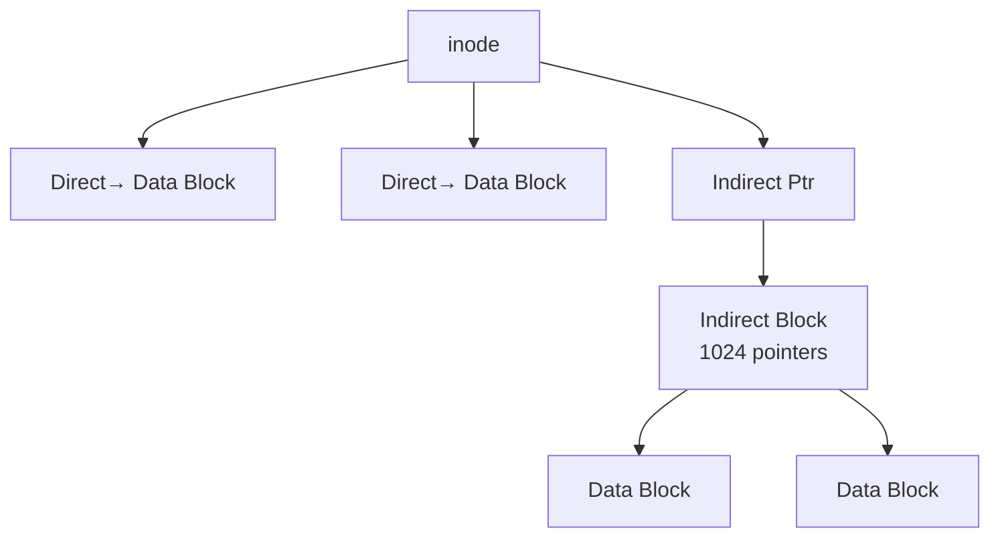

+++
date = '2026-02-21T10:00:00+09:00'
draft = false
title = '[OSTEP] Ch.40 - File System Implementation'
description = "OSTEP 영속성 파트 - File System Implementation 정리 노트"
tags = ["OS", "OSTEP", "Persistence"]
categories = ["OS"]
series = ["OSTEP 정리"]
+++
## Crux (핵심 문제)
파일 시스템을 실제로 어떻게 구현하는가? 디스크 위에 어떤 자료구조를 올려야 하고, 각 시스템 콜(open, read, write)은 어떤 순서로 디스크에 접근하는가?

## 배경 & 동기

Ch.39 - Files and Directories에서 파일 시스템의 API를 봤다. 이번엔 그 API 아래에서 실제로 무슨 일이 벌어지는지 본다.

파일 시스템을 이해하는 두 가지 렌즈:
1. **자료구조**: 디스크에 뭘 어떻게 배치하는가
2. **접근 방법**: open/read/write 시 그 구조들을 어떤 순서로 읽고 쓰는가

이 챕터는 **vsfs (Very Simple File System)** — 단순화한 UNIX 파일 시스템 — 으로 배운다.

## Mechanism (어떻게 동작하는가)

### 디스크 레이아웃 (vsfs, 64블록 기준)

파티션을 4KB 블록으로 나누면:

```
블록 번호: 0    1    2    3~7       8~63
          [S]  [ib] [db] [Inodes]  [Data Region]
```

| 영역 | 내용 |
|------|------|
| **Superblock (S)** | 파일시스템 전체 메타데이터 (총 inode 수, 블록 수, inode 테이블 위치, 매직 넘버) |
| **inode bitmap (ib)** | 각 inode 사용 여부 (1bit씩) |
| **data bitmap (db)** | 각 데이터 블록 사용 여부 |
| **Inode table** | inode 배열 (각 inode = 256bytes, 블록당 16개) |
| **Data region** | 실제 파일/디렉터리 데이터 |

> [!important]
> **마운트 시 Superblock을 먼저 읽는다.** inode 테이블 위치, 블록 수 등 모든 정보가 여기서 시작.

---

### Inode (Index Node)

파일당 하나의 inode. **inode number → inode 위치** 계산:

```
inode_start_addr = 12KB  (예시)
inode의 디스크 주소 = inode_start_addr + (inumber * sizeof(inode))
= 12KB + (32 * 256bytes) = 12KB + 8KB = 20KB
```

inode 안에 들어있는 정보:

```
크기, 권한, 소유자, 접근시각, 수정시각
→ 데이터 블록 포인터들:
  - Direct pointer: 직접 데이터 블록 주소 (12개)
  - Indirect pointer: 포인터들을 담은 블록을 가리킴
  - Double indirect: 간접 포인터 블록들의 블록
  - Triple indirect: 3단계 간접
```



> [!example]
> 4KB 블록, 4byte 포인터 기준:
> - Direct 12개 = 48KB
> - Indirect 1개 = 1024 * 4KB = 4MB
> - Double indirect = 1024 * 4MB = 4GB
> → 충분히 큰 파일도 표현 가능

**디렉터리**도 파일이다! 다만 내용이 `(이름, inode number)` 쌍의 배열:

```
entry: ["foo", 10], ["bar", 20], [".", 5], ["..", 2]
```

---

### 여유 공간 관리: Bitmap

- **inode bitmap**: inode 테이블의 어떤 슬롯이 비어있는지
- **data bitmap**: 데이터 블록의 어떤 블록이 비어있는지
- 새 파일 생성 → bitmap에서 free bit 탐색 → 1로 설정 → inode/data 블록 할당

---

### open() 경로 추적: `/foo/bar` 열기

1. **root inode(#2) 읽기** — 루트 디렉터리는 항상 inode #2
2. **root data block 읽기** — `foo`라는 이름 찾기 → inode number 획득
3. **foo의 inode 읽기**
4. **foo의 data block 읽기** — `bar`라는 이름 찾기 → inode number 획득
5. **bar의 inode 읽기** → open 완료, fd 반환

> [!important]
> 경로가 길수록 읽기 횟수가 선형 증가한다. `/1/2/3/.../100/file`이면 수백 번 읽어야 할 수도!
> → **캐싱이 필수**: 자주 쓰는 inode와 데이터 블록을 메모리에 캐시.

---

### read() 경로: `bar` 파일에서 4KB 읽기

1. inode 읽기 (현재 오프셋에 해당하는 블록 번호 찾기)
2. 해당 데이터 블록 읽기
3. inode의 atime(access time) 업데이트 → inode 쓰기

---

### write() 경로: 새 파일에 쓰기

단순히 데이터만 쓰는 게 아니다. 새 파일에 1블록 쓰면:

1. **inode bitmap 읽기** → free inode 탐색
2. **inode bitmap 쓰기** → 해당 inode를 "사용 중"으로 표시
3. **inode 쓰기** → 새 inode 초기화
4. **data bitmap 읽기** → free 데이터 블록 탐색
5. **data bitmap 쓰기** → 해당 블록 "사용 중"으로 표시
6. **데이터 블록 쓰기** → 실제 사용자 데이터
7. **inode 쓰기** → 크기, 포인터, mtime 업데이트

> [!important]
> **파일 1개 생성 = 최소 7번 I/O!** 이게 파일 시스템이 느린 이유 중 하나.
> 디렉터리 업데이트(parent inode + data)까지 더하면 더 많아진다.

---

### 캐싱과 버퍼링

**읽기 캐시**: 초기엔 고정 크기(전체 메모리의 ~10%) 캐시. 현대는 **unified page cache** — VM 페이지와 파일 캐시를 통합해 동적으로 분배.

**쓰기 버퍼링(Write Buffering)**:
- dirty 블록을 메모리에 모아두다가 5~30초 뒤 한꺼번에 씀
- **장점**: batch, scheduling, 중간에 삭제된 파일은 I/O 완전 생략
- **단점**: 크래시 시 최근 업데이트 소실 → Ch.42 - Crash Consistency FSCK and Journaling 에서 해결

## Policy (왜 이렇게 설계했는가)

| 설계 선택 | Trade-off |
|-----------|-----------|
| inode에 포인터 계층화 (direct/indirect) | 작은 파일은 빠르게(direct), 큰 파일도 지원 |
| bitmap으로 여유 공간 추적 | 단순하고 빠른 연속 공간 탐색 가능 |
| 쓰기 버퍼링 | 성능 ↑ vs 내구성(durability) ↓ |
| Superblock 여러 복사본 | 신뢰성 ↑ (FFS부터 도입) |

## 내 정리

결국 이 챕터는 **"파일 시스템 = 디스크 위의 자료구조 + 접근 알고리즘"**임을 보여준다. inode는 파일의 모든 메타데이터를 담고, bitmap으로 빈 공간을 관리하고, Superblock이 전체 구조를 알고 있다. `open()`은 경로 탐색 = 여러 번의 디스크 읽기이고, `write()`는 생각보다 훨씬 많은 I/O를 발생시킨다. 캐시 없으면 실용적으로 쓸 수가 없다.

## 연결
- 이전: Ch.39 - Files and Directories
- 다음: Ch.41 - Fast File System (FFS)
- 관련 개념: Inode, File System, Superblock, Buffer Cache
