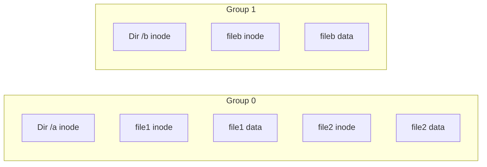

+++
date = '2026-02-23T10:00:00+09:00'
draft = false
title = '[OSTEP] Ch.41 - Fast File System (FFS)'
description = "OSTEP 영속성 파트 - Fast File System (FFS) 정리 노트"
tags = ["OS", "OSTEP", "Persistence"]
categories = ["OS"]
series = ["OSTEP 정리"]
+++
## Crux (핵심 문제)
디스크의 물리적 특성(seek 비용)을 무시하면 파일 시스템 성능이 처참해진다. 어떻게 디스크를 "디스크답게" 취급하는 파일 시스템을 만들 수 있는가?

## 배경 & 동기

### Old UNIX FS의 문제점

최초 UNIX 파일 시스템(Ken Thompson 작)은 너무 단순했다:

```
[S] [Inodes] [Data Region]
```

성능이 끔찍했다 — 피크 디스크 대역폭의 **2%만** 사용. 이유:

1. **inode와 데이터 블록이 멀다**: inode는 앞쪽, 데이터는 뒤쪽 → 파일 하나 읽을 때마다 긴 seek
2. **파편화(Fragmentation)**: free list 기반 할당이 공간을 흩뿌려놓음. 논리적으로 연속된 파일이 물리적으로 디스크 전체에 산재
3. **블록 크기가 너무 작다(512bytes)**: 전송 효율 최악. 블록당 positioning overhead가 너무 큼

```
시간이 지나면 이렇게 된다:
A1 A2 _ _ C1 C2 _ _  (B, D가 지워짐)
→ 새 파일 E(4블록) 할당:
A1 A2 E1 E2 C1 C2 E3 E4  ← E가 쪼개짐 = seek 폭발
```

→ Berkeley 그룹이 **FFS (Fast File System)** 개발 (McKusick et al., 1984)

## Mechanism (어떻게 동작하는가)

### 핵심 아이디어: Cylinder Group (= Block Group)

디스크를 **Cylinder Group**으로 나눈다. 현대 디스크는 실제 실린더 정보를 노출하지 않으므로, 현대 파일 시스템(ext2/3/4)은 이를 **Block Group**이라 부르며 논리 주소 공간을 연속된 구간으로 나눈다.

```
[Group 0] [Group 1] [Group 2] ... [Group N]
```

각 Block Group의 내부 구조:

```
[S(슈퍼블록 사본)] [ib(inode bitmap)] [db(data bitmap)] [Inodes] [Data]
```

> [!important]
> **슈퍼블록을 각 그룹에 복사**: 메인 슈퍼블록이 손상돼도 복구 가능. 신뢰성 향상.

---

### 배치 정책 (Allocation Policy)

핵심 원칙: **"관련된 것은 같은 그룹에, 무관한 것은 다른 그룹에"**

#### 디렉터리 배치

- **free inode가 많고** + **이미 있는 디렉터리 수가 적은** 그룹에 배치
- 목표: 디렉터리를 균등하게 분산 + 하위 파일들이 들어올 자리 확보

#### 파일 배치

1. **파일의 inode와 데이터 블록을 같은 그룹에** → seek 최소화
2. **같은 디렉터리의 파일들을 같은 그룹에** → 디렉터리 순회 시 locality 확보



---

### 큰 파일 예외 (Large File Exception)

큰 파일을 같은 그룹에 전부 넣으면 그 그룹을 독차지해 **다른 파일들이 같은 그룹에 들어오지 못한다**. 그래서 FFS는:

- 파일이 일정 크기(첫 번째 블록 그룹 채울 만큼)를 넘으면 **나머지를 다른 그룹들로 분산**
- Indirect block 경계마다 다른 그룹으로 전환

> [!example]
> 100MB 파일: 처음 몇 블록은 그룹 0에, 이후 chunk는 그룹 1, 2, ... 에 분산
> → 순차 읽기 성능은 약간 손해지만, 다른 파일들과의 co-location 가능

---

### 블록 크기와 작은 파일 처리

FFS는 블록 크기를 4KB (혹은 8KB)로 늘렸다 → 처리량 대폭 향상.

하지만 작은 파일은 **내부 단편화(internal fragmentation)** 문제:

- 50byte 파일 = 4KB 블록 낭비

해결: **Sub-block (fragment)** 개념 도입
- 블록을 더 작은 fragment(512bytes)로 나눔
- 작은 파일은 fragment 단위로 할당, 파일이 커지면 전체 블록으로 재할당
- 복잡도 증가가 트레이드오프

---

### 파라미터화된 배치 (Parameterized Placement)

회전 지연(rotational delay) 문제: 연속 블록을 연속으로 읽으면 디스크 회전 속도 때문에 다음 블록 도달 전에 이미 지나쳐버린다.

FFS는 **skip sector** 전략 — 블록 사이에 약간의 간격을 두어 회전 지연을 고려한 배치.

> [!question]
> 현대 디스크는 내부적으로 **track buffer(캐시)**를 갖고 있어 트랙 전체를 미리 읽어둔다. 그래서 이 문제는 이제 덜 중요하다.

---

### 추가 기능들 (FFS가 같이 도입한 것들)

| 기능 | 의의 |
|------|------|
| **긴 파일명** | 8자 제한 → 임의 길이 |
| **Symbolic Link** | 다른 파티션/디렉터리도 가리킬 수 있는 유연한 링크 |
| **atomic rename()** | 파일 교체가 crash-safe |

> [!important]
> FFS의 교훈: 기술적 혁신(disk-awareness)과 **사용성 개선**(긴 파일명, symlink 등)이 함께 있었기에 널리 채택되었다.

## Policy (왜 이렇게 설계했는가)

| 설계 선택 | Trade-off |
|-----------|-----------|
| Cylinder/Block Group | 관련 데이터 locality ↑, 관리 복잡도 약간 ↑ |
| 큰 파일 분산 | group 독점 방지 ↑, 순차 성능 약간 ↓ |
| 슈퍼블록 복사 | 신뢰성 ↑, 공간 낭비 소폭 ↑ |
| Sub-block | 내부 단편화 ↓, 구현 복잡도 ↑ |

## 내 정리

결국 이 챕터는 **"디스크를 디스크답게 취급하라"**는 메시지다. 메모리처럼 쓰면 seek 비용 때문에 성능이 처참해진다. Block Group으로 나눠서 관련 데이터를 물리적으로 가까이 두는 것이 FFS의 핵심. 현대 Linux ext2/3/4도 이 아이디어를 그대로 계승한다.

## 연결
- 이전: Ch.40 - File System Implementation
- 다음: Ch.42 - Crash Consistency FSCK and Journaling
- 관련 개념: File System, Inode, Superblock
