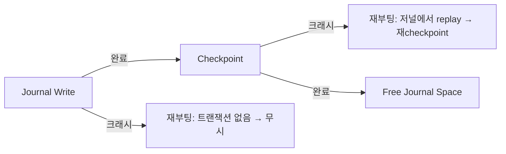

+++
date = '2026-02-26T10:00:00+09:00'
draft = false
title = '[OSTEP] Ch.42 - Crash Consistency FSCK and Journaling'
description = "OSTEP 영속성 파트 - Crash Consistency FSCK and Journaling 정리 노트"
tags = ["OS", "OSTEP", "Persistence"]
categories = ["OS"]
series = ["OSTEP 정리"]
+++
## Crux (핵심 문제)
파일 시스템은 여러 디스크 구조를 **한 번에** 업데이트해야 일관성을 유지한다. 그런데 디스크는 한 번에 하나만 쓸 수 있고, 그 사이에 크래시가 날 수 있다. 어떻게 크래시 후에도 일관된 파일 시스템을 보장하는가?

## 배경 & 동기

파일 시스템은 여러 구조(inode, bitmap, data block)가 **동시에** 갱신돼야 한다. 예: 파일에 블록 하나 추가(append):

```
업데이트 필요:
  1. I[v2]: inode (새 블록 포인터 + 크기 업데이트)
  2. B[v2]: data bitmap (새 블록 "사용 중"으로 표시)
  3. Db: 실제 데이터 블록
```

이 셋 중 일부만 쓰고 크래시가 나면? → **불일치(inconsistency)**

> [!example]
> **크래시 시나리오들:**
> - Db만 쓰임 → 데이터는 있지만 inode도 bitmap도 모름. 마치 없는 것처럼. (무해)
> - I[v2]만 쓰임 → inode가 블록 5를 가리키지만 bitmap은 5가 free라 함. **inode와 bitmap 불일치**. 읽으면 garbage 반환.
> - B[v2]만 쓰임 → bitmap은 5가 사용 중이지만 inode는 모름. **공간 누수(space leak)**.
> - I[v2] + B[v2]만 쓰임 → metadata는 일관되지만 Db 위치엔 garbage.
> - I[v2] + Db만 쓰임 → inode ↔ bitmap 불일치.
> - B[v2] + Db만 쓰임 → 어느 파일 것인지 inode가 없어 고아 블록.

이 문제를 **crash-consistency problem (consistent-update problem)** 이라 한다.

## Mechanism (어떻게 동작하는가)

### 해결책 1: fsck (File System Checker)

초기 접근: **"불일치가 생기면 그냥 두고, 부팅 시 고친다"**

fsck는 파일 시스템이 마운트되기 전 실행되며, 전체 디스크를 스캔해 일관성을 복원한다:

| 검사 항목 | 내용 |
|-----------|------|
| Superblock 검사 | 파일시스템 크기 > 할당된 블록 수? 등 sanity check |
| Free block 스캔 | inode들을 스캔해 실제 사용 블록 목록 재구성 → bitmap 재생성 |
| Inode 상태 | 타입 필드가 유효한가? 문제있으면 해당 inode 초기화 |
| Link count 확인 | 디렉터리 트리 전체 순회해 link count 직접 계산, inode의 값과 비교 |
| 중복 포인터 | 두 inode가 같은 블록을 가리키면 하나 클리어 또는 복사 |
| Bad block | 파티션 범위 밖의 포인터 제거 |
| 디렉터리 검사 | `.`/`..` 유효성, 각 엔트리의 inode가 실제 할당되어 있는지 |

**fsck의 치명적 문제**: **너무 느리다**

- 디스크 전체를 스캔해야 함 → 용량이 클수록 수십 분~수 시간
- 블록 3개를 업데이트하다 크래시났는데 전체 디스크를 검사? 불합리하다
- 디스크가 TB급, RAID로 커질수록 비용 폭발적 증가

---

### 해결책 2: Journaling (Write-Ahead Logging)

DB 세계의 **write-ahead logging** 아이디어를 파일 시스템에 도입.

> **핵심 아이디어**: 실제 디스크 구조를 업데이트하기 전에, 먼저 **"뭘 할 예정인지"를 로그(journal)에 기록**한다. 크래시 나도 로그를 보고 복구하면 된다.

ext2 → ext3: Journal 영역이 추가됨

```
[Super] [Journal] [Group 0] [Group 1] ... [Group N]
```

#### Data Journaling (전체 저널링)

append 예시에서 저널에 먼저 기록:

```
Journal: [TxB] [I[v2]] [B[v2]] [Db] [TxE]
          시작   메타    비트맵  데이터  끝
```

- **TxB (Transaction Begin)**: 트랜잭션 시작 + TID + 업데이트할 최종 주소 정보
- **TxE (Transaction End)**: 트랜잭션 완료 마커 (512bytes → atomic write 보장)
- **Physical logging**: 블록의 실제 내용을 그대로 저널에 복사

프로토콜 (3단계):

```
1. Journal Write  : TxB + 내용(I[v2], B[v2], Db) + TxE를 저널에 기록, 완료 대기
2. Checkpoint     : I[v2], B[v2], Db를 실제 위치에 기록
3. Free           : 저널 슈퍼블록에 해당 트랜잭션 free 표시
```

> [!important]
> **TxE는 반드시 마지막에 따로 쓴다!** 한꺼번에 보내면 디스크 내부 스케줄링으로 TxE가 먼저 쓰일 수 있음 → garbage 데이터를 유효한 트랜잭션으로 착각. TxE는 512bytes짜리 atomic write로 단독 발행.

#### 크래시 후 복구

- 저널 기록 전 크래시 → pending update 무시 (트랜잭션 없음)
- 저널 기록 완료 후, checkpoint 전 크래시 → 재부팅 시 저널 스캔 → committed 트랜잭션 **redo(재실행)**



---

#### 성능 최적화: Batching

두 파일을 연속 생성하면 같은 inode bitmap, 같은 디렉터리 inode를 두 번씩 저널에 쓰게 된다. 낭비!

**Global transaction buffer**: dirty 블록들을 메모리에 모아 5초마다 한 번에 flush. 같은 블록의 중복 업데이트는 합쳐서 한 번만 씀.

---

#### Circular Log (순환 로그)

저널은 크기가 유한하다 → checkpoint 완료된 트랜잭션을 **free**로 표시하고 공간 재사용.

**저널 슈퍼블록**: 가장 오래된 / 최신 비-checkpoint 트랜잭션 위치 추적.

최종 4단계 프로토콜:
```
1. Journal Write   : TxB + 내용 → 저널 기록
2. Journal Commit  : TxE → 저널 기록 (atomic)
3. Checkpoint      : 실제 위치에 기록
4. Free            : 저널 슈퍼블록 업데이트 (공간 반환)
```

---

#### Metadata Journaling (Ordered Journaling)

Data Journaling의 문제: **모든 데이터를 두 번 씀** (저널 + 실제 위치). 쓰기 트래픽 2배, 대역폭 반토막.

**Metadata Journaling**: 사용자 데이터(Db)는 저널에 안 쓰고, metadata(inode + bitmap)만 저널에 기록.

```
Journal: [TxB] [I[v2]] [B[v2]] [TxE]   ← Db 없음
실제 위치에: Db 직접 기록
```

**주의**: 순서가 중요하다!

> [!important]
> **Db를 먼저 써야 한다!** 만약 metadata(I[v2], B[v2])를 먼저 커밋하고 Db가 아직 안 쓰였을 때 크래시 나면? inode는 블록 5를 가리키지만 거기엔 garbage. 포인터가 garbage를 가리키게 됨.

Metadata Journaling 5단계:
```
1. Data Write         : Db를 최종 위치에 기록, 완료 대기
2. Journal Meta Write : TxB + I[v2] + B[v2] → 저널 기록
3. Journal Commit     : TxE → 저널 기록
4. Checkpoint Meta    : I[v2], B[v2] → 최종 위치에 기록
5. Free               : 저널 슈퍼블록 업데이트
```

> "포인터가 가리키는 대상을 먼저 쓰고, 포인터를 나중에 써라" → crash consistency의 핵심 원칙

Linux ext3는 세 가지 모드 제공:
- **data**: 전체 데이터 + metadata 저널링 (가장 안전, 가장 느림)
- **ordered**: metadata만 저널링, data는 metadata 전에 먼저 기록 (기본값, 균형)
- **unordered**: metadata만 저널링, data 순서 보장 없음 (가장 빠름, 크래시 시 stale data 가능)

## Policy (왜 이렇게 설계했는가)

| 방법 | 복구 속도 | 정상 성능 | 복잡도 |
|------|-----------|-----------|--------|
| fsck | 매우 느림 (전체 디스크) | 보통 | 낮음 |
| Data Journaling | 빠름 (저널만) | 느림 (2배 쓰기) | 중간 |
| Metadata Journaling | 빠름 | 보통 | 중간 |

## 내 정리

결국 이 챕터는 **"여러 디스크 블록을 atomic하게 업데이트하는 것이 불가능하기 때문에 생기는 문제와 그 해결책"**이다. fsck는 사후 수습이라 너무 느리고, Journaling은 "미리 메모장에 적어두기"로 크래시 후 빠른 복구를 가능하게 한다. Metadata Journaling(ordered mode)이 성능과 안전의 균형으로 가장 널리 쓰인다. 핵심 원칙: **"가리킴을 받는 것을 먼저 쓰고, 가리키는 것을 나중에 써라"**.

## 연결
- 이전: Ch.41 - Fast File System (FFS)
- 다음: Ch.43 - Log-structured File System (LFS)
- 관련 개념: Journaling, File System, Inode
