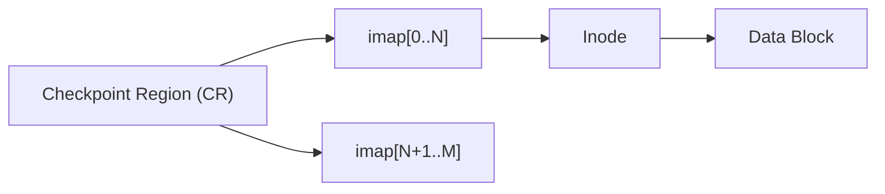

+++
date = '2026-02-28T10:00:00+09:00'
draft = false
title = '[OSTEP] Ch.43 - Log-structured File System (LFS)'
description = "OSTEP 영속성 파트 - Log-structured File System (LFS) 정리 노트"
tags = ["OS", "OSTEP", "Persistence"]
categories = ["OS"]
series = ["OSTEP 정리"]
+++
## Crux (핵심 문제)
쓰기 성능이 점점 중요해지는 세상에서, 어떻게 파일 시스템의 **모든 쓰기를 sequential write**로 만들 수 있을까? random write를 없애면 HDD의 seek/rotation 비용을 획기적으로 줄일 수 있다.

## 배경 & 동기

1990년대 초 Rosenblum & Ousterhout이 LFS를 설계한 배경 4가지:

1. **메모리 증가** → 점점 더 많은 read가 메모리 캐시(Buffer Cache)에서 처리됨 → 파일 시스템 성능은 사실상 **write 성능**에 좌우
2. **Sequential vs. Random 성능 격차** → Sequential 대역폭은 크게 늘었지만 seek/rotation 비용은 별로 줄지 않음 → Sequential write를 극대화해야 함
3. **기존 FFS의 비효율** → 1 블록짜리 파일 하나를 만드는 데도 inode 쓰기, bitmap 쓰기, 디렉터리 쓰기 등 **다수의 short seek** 발생
4. **RAID 비친화적** → RAID-4/5의 small-write problem을 기존 FS는 해결하지 못함

> [!important]
> LFS의 핵심 아이디어: **메모리에 업데이트를 모아서(write buffering) 한 번에 큰 sequential write로 디스크에 플러시한다.**

## Mechanism (어떻게 동작하는가)

### 1. Sequential Write와 Write Buffering

LFS는 모든 쓰기(데이터 + 메타데이터 모두)를 디스크의 순차 위치에 append한다. 단, 한 블록씩 쓰면 rotation delay 문제가 있으므로, **segment** 단위로 모아서 한 번에 flush한다.

```
Segment = 여러 블록의 묶음 (보통 수 MB)
         = data blocks + inode blocks + inode map 조각 등
```

**최적 버퍼 크기** (디스크 효율 90% 목표 기준):
```
D = (F / (1-F)) × Rpeak × Tposition
  ≈ 9 MB  (seek 10ms, 전송속도 100MB/s 가정)
```
→ seek 비용을 분할상각(amortize)하려면 한 번에 수 MB씩 써야 한다.

---

### 2. Inode 위치 문제: Imap

기존 FS는 inode를 **고정 위치**에 두어서 번호로 바로 찾았다. LFS는 "절대 덮어쓰지 않는다"는 원칙 때문에 inode를 계속 **새 위치**에 쓴다. → inode를 어떻게 찾지?

**해결: Inode Map (imap)**

```
imap[inode_number] = 해당 inode의 현재 디스크 주소
```

imap 자체도 업데이트될 때마다 segment에 함께 append된다. → imap 조각들이 디스크 곳곳에 흩어짐.

---

### 3. Checkpoint Region (CR): 루트 찾기

imap 조각들의 위치를 추적하기 위해 **Checkpoint Region (CR)**을 사용한다.

- 디스크의 **고정 위치**에 존재 (두 개, 양쪽 끝에 각각)
- imap의 각 조각이 어디 있는지 포인터 목록을 담음
- 주기적으로(~30초) 갱신

```
CR → imap 조각들 → inode → data block
```



> [!important]
> CR을 읽으면 → imap 전체를 재구성 가능 → 모든 inode 위치 파악 → 파일 시스템 접근 가능.

---

### 4. 파일 읽기 흐름

파일을 읽을 때:
1. CR 읽기 (한 번, 부팅/마운트 시)
2. imap에서 inode number → inode 주소 찾기
3. inode 읽기 → 데이터 블록 주소
4. 데이터 블록 읽기

성능 걱정? → imap은 메모리에 캐시하므로 실제론 디스크 추가 접근이 거의 없다.

---

### 5. Directory 구조

LFS 디렉터리는 일반 FS와 동일: `(파일명 → inode number)` 매핑.
단, **inode number를 알면 imap을 통해 inode 위치를 찾는다.**

> [!example]
> `/foo/bar` 읽기:
> 1. root inode # → imap → root inode → root directory data
> 2. "foo"의 inode # → imap → foo inode → foo directory data
> 3. "bar"의 inode # → imap → bar inode → bar data

---

### 6. Garbage Collection (세그먼트 정리)

LFS는 파일을 덮어쓰지 않기 때문에 **old version이 디스크에 남는다.** 이 죽은 블록들을 회수해야 한다.

**Segment Cleaner (GC 프로세스)**:
1. 오래된 세그먼트 M개를 읽어 **살아있는 블록(live block)** 찾기
2. 살아있는 블록들을 새 세그먼트에 모아 쓰기
3. 오래된 세그먼트 M개를 free로 반환

**살아있는 블록 판별 방법**: 각 세그먼트에 **Segment Summary Block** 저장
```
SS[block_offset] = (파일 inode_number, 블록 오프셋)
```

판별 로직:
```python
(N, T) = SegmentSummary[A]
inode = Read(imap[N])
if inode[T] == A:
    # 살아있음 (live)
else:
    # 죽은 블록 (garbage)
```

**언제, 어떤 세그먼트를 정리하나?**
- **언제**: idle time, 주기적, 디스크가 꽉 찰 때
- **어떤 세그먼트**: hot(자주 변경) vs. cold(변경 적음) 구분
  - **cold segment는 일찍 정리**: 내용이 안정적이라 대부분 live → 정리 후 큰 연속 공간 확보
  - **hot segment는 나중에 정리**: 곧 또 죽을 블록이 많아서 기다리면 GC 효율이 올라감

---

### 7. Crash Recovery

LFS는 CR을 30초마다 갱신 → 크래시 시 최대 30초 분의 업데이트 손실 위험.

**두 가지 크래시 상황:**

1. **CR 업데이트 중 크래시**: CR을 양쪽 끝에 두 개 유지 + timestamp pair로 원자적 업데이트 보장
2. **세그먼트 쓰기 중 크래시**: **Roll Forward** 기법
   - 마지막 정상 CR에서 시작
   - 로그의 끝을 찾아 그 이후 세그먼트를 스캔
   - 유효한 업데이트를 파일 시스템에 반영 → 손실 최소화

## Policy (왜 이렇게 설계했는가)

| 항목 | LFS | FFS |
|------|-----|-----|
| 쓰기 방식 | 항상 sequential append | 제자리 덮어쓰기 |
| 쓰기 성능 | 탁월 (HDD 대역폭 최대한 활용) | Random write 많아 느림 |
| 읽기 성능 | CR→imap 경유 (메모리 캐시로 대부분 커버) | 고정 위치라 빠름 |
| Crash recovery | Roll forward (빠름) | fsck (전체 스캔, 느림) |
| RAID 친화성 | Large write → small-write problem 없음 | RAID-4/5에 비효율적 |
| 공간 효율 | GC 비용 + dead block 공간 점유 | 단편화 있지만 in-place |

> [!important]
> **LFS의 핵심 trade-off**: 쓰기 성능을 극대화하는 대신, **Garbage Collection이라는 비용**을 감수한다. GC 오버헤드에 대한 논란이 LFS 초기 채택을 제한했다.

**LFS의 유산 (Copy-on-Write 방식):**

LFS의 "절대 덮어쓰지 않고 새 위치에 씀" 아이디어 = Copy-on-Write.
현대 파일 시스템에 계승:
- **NetApp WAFL**: GC 문제를 snapshot 기능으로 역이용 (오래된 버전 = 스냅샷)
- **Sun ZFS**: Copy-on-write FS의 표준
- **Linux btrfs**: ZFS와 유사한 COW 기반
- **Flash-based SSDs**: 내부적으로 LFS와 동일한 log-structured FTL 사용 → Ch.44에서 계속

## 코드 & 실험

Segment Summary Block으로 liveness 판별하는 로직이 핵심. `lfs.py` 시뮬레이터로 세그먼트 상태, GC 동작, Checkpoint 갱신 흐름을 확인 가능.

## 내 정리

결국 이 챕터는 **"random write를 sequential write로 바꾸기 위해, 절대 제자리에 쓰지 않고 항상 append한다"** 는 단 하나의 아이디어를 끝까지 밀어붙인 이야기다. 그 결과로 imap, CR, GC라는 복잡한 메커니즘이 생겼지만, 쓰기 성능과 크래시 복구 속도라는 큰 이점을 얻는다. Copy-on-Write라는 이름으로 지금도 살아있다.

## 연결
- 이전: Ch.42 - Crash Consistency FSCK and Journaling
- 다음: Ch.44 - Flash-based SSDs
- 관련 개념: File System, Inode, Copy-on-Write, Buffer Cache, Journaling
