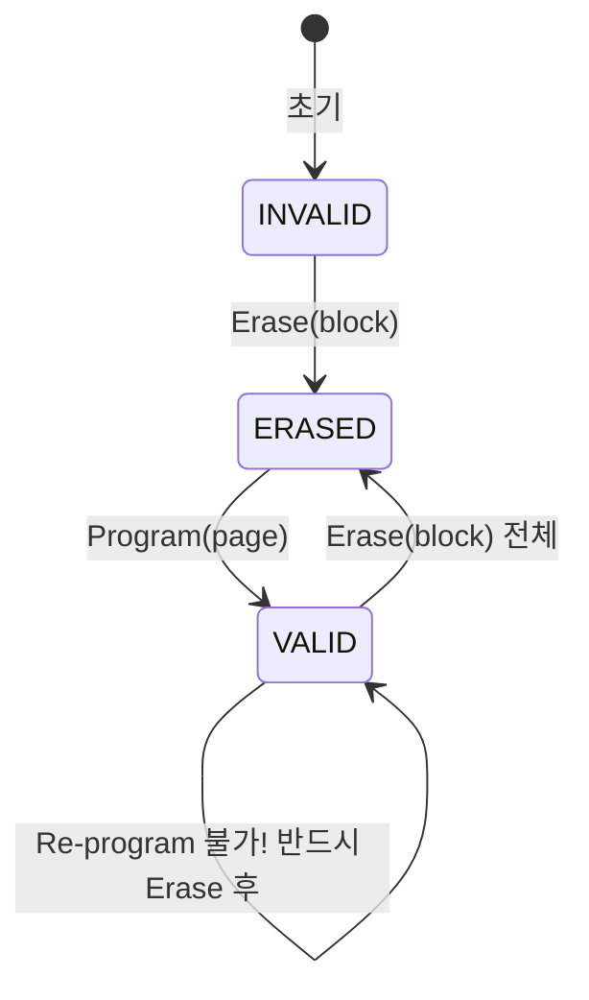

+++
date = '2026-03-02T10:00:00+09:00'
draft = false
title = '[OSTEP] Ch.44 - Flash-based SSDs'
description = "OSTEP 영속성 파트 - Flash-based SSDs 정리 노트"
tags = ["OS", "OSTEP", "Persistence"]
categories = ["OS"]
series = ["OSTEP 정리"]
+++
## Crux (핵심 문제)
NAND Flash는 **"페이지 단위로 읽고, 블록 단위로 지워야 쓸 수 있는"** 특이한 하드웨어다. 이런 제약 위에서 어떻게 일반 블록 디바이스처럼 동작하는 고성능 SSD를 만드는가? 그리고 반복 쓰기로 인한 **마모(wear out)** 문제를 어떻게 해결하는가?

## 배경 & 동기

Hard Disk Drives는 기계적 arm과 회전하는 platter 때문에 seek/rotation 지연이 크다. Flash는 순수 반도체라 이런 물리적 제약이 없다.
→ Random read 성능이 HDD 대비 몇 배~몇 십 배 빠르다.
→ 단, 쓰기 방식이 특이하고 마모 문제가 있어 그냥 쓰면 안 된다.

## Mechanism (어떻게 동작하는가)

### 1. Flash 구조

```
Bank/Plane
  └── Block (128KB ~ 256KB, erase 단위)
        └── Page (2~4KB, read/program 단위)
              └── Cell (1~3 bits 저장)
```

셀 종류:
- **SLC** (Single-Level Cell): 1bit/셀, 빠르고 내구성 높음 (100,000 P/E)
- **MLC** (Multi-Level Cell): 2bit/셀, 보통 (10,000 P/E)
- **TLC** (Triple-Level Cell): 3bit/셀, 저렴하지만 느리고 수명 짧음

> [!important]
> NAND Flash의 용어 충돌 주의: 여기서 "block"은 디스크의 sector(512B)와 다르고, "page"는 가상 메모리의 page와 다르다. 문맥에 따라 구분해야 한다.

---

### 2. Flash의 세 가지 기본 연산

| 연산 | 단위 | 속도 (MLC 기준) | 특징 |
|------|------|----------|------|
| Read | Page | ~50 µs | Random access 가능, 위치 무관 |
| Program | Page | ~600~900 µs | Erase된 상태여야만 가능 |
| Erase | Block | ~3,000 µs | block 전체를 1로 리셋 |

**페이지 상태 전이:**


**핵심 제약**: 페이지를 수정하려면 반드시 해당 블록 전체를 먼저 Erase해야 한다. 블록 안의 다른 페이지 데이터는 미리 다른 곳에 복사해두어야 한다.

> [!example]
> 페이지 0을 수정하고 싶을 때:
> 1. 블록 전체(페이지 0~3)를 메모리에 읽기
> 2. 블록 Erase (모두 1로 리셋)
> 3. 페이지 0의 새 내용 + 페이지 1~3의 기존 내용을 Program
> → read-modify-erase-program 사이클: 비용이 크다!

---

### 3. 성능 & 신뢰성

**신뢰성 문제:**
- **Wear Out**: P/E 사이클 반복 시 전하 누적 → 0/1 구분 불가 → 블록 불량
- **Program Disturb / Read Disturb**: 인접 페이지의 비트가 의도치 않게 바뀔 수 있음

→ FTL(Flash Translation Layer)이 이 문제들을 소프트웨어로 해결해야 한다.

---

### 4. Flash Translation Layer (FTL)

SSD는 호스트에게 **기존 블록 디바이스 인터페이스** (512B 섹터 읽기/쓰기)를 노출한다. 내부적으로는 FTL이 논리 주소 → 물리 Flash 연산으로 변환한다.

```
Host → [Logical Block Address] → FTL → [물리 Flash: Read/Erase/Program]
```

**FTL의 두 가지 주요 목표:**
1. **고성능**: Write Amplification 최소화
2. **고신뢰성**: Wear Leveling (마모 균등 분산)

---

#### 나쁜 방법: Direct Mapping

논리 페이지 N → 물리 페이지 N으로 바로 매핑.
- 쓰기 시 read-modify-erase-program 사이클 반복 → **쓰기 증폭(Write Amplification)** 심각
- 자주 쓰는 논리 주소 → 동일 물리 블록만 반복 erase → **빠른 마모**
- 결론: 직접 매핑 FTL은 쓰면 안 된다.

---

#### 좋은 방법: Log-structured FTL

Ch.43 - Log-structured File System (LFS)의 아이디어와 동일! 쓰기가 올 때 마다 현재 쓰고 있는 블록의 다음 빈 페이지에 **append**한다.

**매핑 테이블 (Mapping Table)**:
```
logical_page → physical_page  (메모리에 캐시, 플래시에도 영속 저장)
```

> [!example]
> Write(100)=a1, Write(101)=a2, Write(2000)=b1, Write(2001)=b2 순서로 오면:
> ```
> 물리 블록 0: [a1(L100) | a2(L101) | b1(L2000) | b2(L2001)]
> 매핑: {100→P0, 101→P1, 2000→P2, 2001→P3}
> ```
> 이후 Write(100)=c1 이 오면 다음 빈 페이지에 append:
> ```
> 물리 블록 0: [a1(L100,stale) | a2(L101) | b1(L2000) | b2(L2001)]
> 물리 블록 1: [c1(L100) | ...]
> 매핑: {100→P4(새 위치), ...}
> ```
> → a1이 있던 P0는 이제 stale(쓰레기) 블록

---

### 5. Garbage Collection

Stale 블록들이 누적되면 사용 가능한 공간이 줄어든다. **Garbage Collection (GC)**으로 회수:

1. stale 블록이 많은 물리 블록 선택
2. 해당 블록의 **live 페이지들**을 새 위치에 복사
3. 원래 블록 Erase → free 블록으로 반환

> [!important]
> GC는 **Write Amplification**을 일으킨다: 사용자가 쓴 것보다 더 많은 실제 write가 발생한다. GC 오버헤드 최소화가 FTL 설계의 핵심 과제.

---

### 6. Wear Leveling

특정 물리 블록만 집중적으로 쓰면 그 블록만 먼저 망가진다. FTL은 P/E 횟수를 추적하여 **모든 블록이 골고루 마모되도록** 새 쓰기를 분산시킨다.


> [!important]
> "절대 변하지 않는" cold 데이터도 주기적으로 다른 블록으로 이동시켜야 한다. 그렇지 않으면 자주 쓰는 블록만 마모되어 wear leveling이 깨진다.

---

### 7. FTL 매핑 방식 비교

| 방식 | 매핑 granularity | 특징 |
|------|-----------------|------|
| Block-level | 블록 단위 | 매핑 테이블 작음, 쓰기 유연성 낮음 |
| Page-level | 페이지 단위 | 완전한 유연성, 매핑 테이블 큼 |
| Hybrid (log + block) | 혼합 | 균형 잡힌 접근, 현실적 선택 |

현대 SSD는 대부분 **page-level 또는 hybrid** 매핑을 사용한다.

## Policy (왜 이렇게 설계했는가)

**SSD vs. HDD 비교:**

| 항목 | SSD (Flash) | HDD |
|------|------------|-----|
| Random Read | 매우 빠름 (~50µs) | 느림 (ms 단위) |
| Sequential Read | 빠름 | 빠름 |
| Random Write | FTL 덕분에 빠름 | 느림 |
| 마모 | P/E cycle 제한 | 헤드 충돌 등 기계적 실패 |
| 가격/GB | 비쌈 (하락 중) | 저렴 |
| 소음/전력 | 무소음, 저전력 | 소음, 전력 큼 |

**SSD가 HDD를 대체하는 이유**: Random read/write 성능 차이가 압도적. 특히 OS, DB, 서버 워크로드에서 체감 속도가 다르다.

**LFS와의 관계:**
Flash SSD 내부 FTL은 LFS와 동일한 log-structured write 전략을 사용한다. Ch.43 - Log-structured File System (LFS)에서 배운 GC, wear leveling, 매핑 테이블 개념이 그대로 적용된다.

> [!important]
> **File System + SSD의 중복 간접 계층 문제**: 파일 시스템이 이미 logical → virtual block 매핑을 하는데, FTL도 logical → physical 매핑을 한다. 이 이중 indirection이 때로 비효율을 낳는다(ZFS + SSD 연구).

## 내 정리

결국 이 챕터는 **"Flash의 이상한 쓰기 방식(erase-before-write)을 소프트웨어(FTL)로 숨겨서 일반 블록 디바이스처럼 보이게 만든다"** 는 이야기다. FTL은 LFS와 동일한 log-structured 방식으로 write amplification을 줄이고, wear leveling으로 마모를 분산시키고, GC로 stale 블록을 회수한다. SSD의 성능은 NAND 칩 자체보다 FTL의 품질에 더 크게 좌우된다.

## 연결
- 이전: Ch.43 - Log-structured File System (LFS)
- 다음: Ch.45 - Data Integrity and Protection
- 관련 개념: File System, Copy-on-Write, RAID
