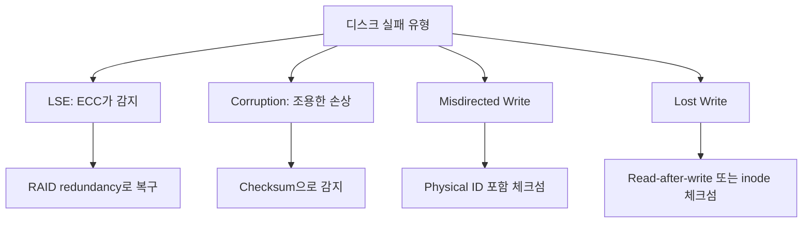

+++
date = '2026-03-05T10:00:00+09:00'
draft = false
title = '[OSTEP] Ch.45 - Data Integrity and Protection'
description = "OSTEP 영속성 파트 - Data Integrity and Protection 정리 노트"
tags = ["OS", "OSTEP", "Persistence"]
categories = ["OS"]
series = ["OSTEP 정리"]
+++
## Crux (핵심 문제)
저장 장치는 완벽하지 않다. 디스크가 "정상 작동 중"이어도 데이터가 조용히 손상될 수 있다. 저장 시스템은 어떻게 넣은 데이터가 꺼낼 때도 동일함을 보장하는가?

## 배경 & 동기

RAID 챕터에서 배운 fail-stop 모델은 너무 단순하다. 현실에서 디스크는 훨씬 다양한 방식으로 실패한다.

**Fail-partial 모델**: 디스크 전체가 죽지 않고, 일부 블록만 문제가 생기는 경우가 더 흔하다.

## Mechanism (어떻게 동작하는가)

### 1. 디스크 실패 모드

#### Latent Sector Error (LSE, 잠재적 섹터 오류)
- 디스크 헤드 충돌, 우주선(cosmic ray) 등으로 섹터 손상
- 디스크 내장 ECC(Error Correcting Code)가 감지, 읽기 시 오류 반환
- **non-silent fault**: 읽으려 하면 오류가 발생함 → 감지 가능

#### Block Corruption (블록 손상)
- 버그있는 펌웨어가 잘못된 위치에 씀, 버스 전송 오류 등
- 디스크 ECC는 정상이라 하지만 **내용이 틀린** 데이터를 반환
- **silent fault**: 디스크가 오류를 알려주지 않음 → 감지 어려움!

> [!important]
> LSE는 빈번하지 않지만 충분히 자주 일어난다 (연구: 3년 동안 저가 드라이브의 ~9%에서 발생). 단순히 "디스크가 괜찮으면 데이터도 괜찮다"고 믿으면 안 된다.

---

### 2. LSE 처리

LSE는 감지가 쉬우므로 처리도 상대적으로 간단하다:
- RAID 미러 → 다른 사본에서 읽기
- RAID-4/5 → 패리티로 재구성

**문제**: 디스크 전체 실패 + LSE 동시 발생 시 RAID 복구 자체가 실패할 수 있다.
→ NetApp RAID-DP: 패리티 디스크를 두 개로 늘려 이중 실패를 커버.

---

### 3. 체크섬(Checksum)으로 Corruption 감지

Silent corruption을 잡는 주요 기법: **Checksum**

> 데이터 블록 D를 저장할 때 같이 체크섬 C(D)도 저장. 읽을 때 다시 계산한 C'(D)와 비교 → 다르면 손상 감지.

**체크섬 함수 종류:**

| 방식 | 방법 | 강도 | 속도 |
|------|------|------|------|
| XOR | 모든 바이트를 XOR | 약함 (짝수 비트 변화 감지 못함) | 빠름 |
| Addition | 2의 보수 덧셈, overflow 무시 | 약함 (shift 감지 못함) | 빠름 |
| Fletcher | s1 = Σdi mod 255, s2 = Σs1 mod 255 | 강함 | 보통 |
| CRC | 데이터를 큰 이진수로 보고 k로 나눈 나머지 | 강함 | 보통~느림 |

> [!important]
> 어떤 체크섬이든 **완벽하지 않다**: 서로 다른 두 데이터가 같은 체크섬을 가질 수 있다 (collision). 크기가 작은 summary이기 때문에 필연적. 목표는 collision 확률을 최소화하는 것.

**체크섬 디스크 레이아웃:**

```
방법 1: 섹터당 체크섬 (드라이브가 520B 섹터 지원 시)
[C(D0)][D0] [C(D1)][D1] [C(D2)][D2] ...

방법 2: 체크섬을 별도 섹터에 묶음
[C(D0)|C(D1)|...|C(Dn)] [D0] [D1] ... [Dn]
```

---

### 4. Misdirected Write (잘못된 위치에 쓰기)

디스크 컨트롤러가 데이터를 올바르게 기록했지만 **엉뚱한 위치**에 써버리는 경우.
- 기본 체크섬으로는 감지 불가: 데이터 내용 자체는 맞고, ECC도 통과함

**해결**: 체크섬에 **물리 주소 정보(Physical ID)**도 포함

```
C(D) = checksum + disk_number + sector_offset
```

읽을 때 체크섬 내의 주소와 실제 읽은 위치가 다르면 → misdirected write 감지.

```
Disk 0, Block 2:  [C(D) | disk=0, block=2] [D]
Disk 1, Block 2:  [C(D) | disk=1, block=2] [D]
```

---

### 5. Lost Write (쓰기 분실)

디스크가 "쓰기 완료"를 알려줬지만 실제로 **플래터에 반영되지 않은** 경우.
- 이전 체크섬(이전 데이터의 것)이 그대로 있어서 기본 체크섬으로도 못 잡음

**해결책들:**
- **Read-after-write (쓰기 직후 검증 읽기)**: 쓴 뒤 바로 읽어서 확인 → 안전하지만 I/O 2배
- **inode에도 체크섬 포함 (ZFS 방식)**: inode가 가리키는 데이터 블록의 체크섬을 inode에도 저장. 데이터 쓰기는 lost되었지만 inode는 업데이트됐다면 체크섬 불일치로 감지.

---

### 6. Disk Scrubbing (디스크 스크러빙)

데이터 대부분은 오랫동안 읽히지 않는다. 손상이 되어도 한참 후에야 발견되고, 그때는 이미 모든 사본이 손상되어 있을 수 있다.

**Scrubbing**: 백그라운드에서 주기적으로 모든 블록을 읽고 체크섬 검증.
- 보통 야간/주간 단위로 스케줄링
- LSE 및 silent corruption 조기 발견
- 연구에 따르면 대부분의 LSE는 scrubbing 중에 발견됨

---

### 7. 체크섬 오버헤드

**공간 오버헤드:**
- 8바이트 체크섬 / 4KB 데이터 블록 = **0.19%** → 매우 작다

**시간 오버헤드:**
- CPU: 저장 시 + 읽기 시 체크섬 계산 (data copy와 병합하면 줄일 수 있음)
- I/O: 체크섬이 데이터와 분리된 경우 추가 I/O 발생 (레이아웃 설계로 완화 가능)
- Scrubbing: 야간 실행으로 영향 최소화

## Policy (왜 이렇게 설계했는가)



| 실패 유형 | 감지 방법 | 복구 방법 |
|-----------|-----------|-----------|
| LSE | 디스크 ECC, scrubbing | RAID redundancy |
| Silent corruption | Checksum | 다른 사본, 오류 반환 |
| Misdirected write | Physical ID 포함 체크섬 | 다른 사본 |
| Lost write | Read-after-write, inode 체크섬 | 다른 사본 |

> [!important]
> **"더 비싼 드라이브가 더 안전하다"는 건 틀렸다.** 연구에 따르면 비싼 드라이브도 LSE와 corruption이 발생한다(빈도만 낮을 뿐). 소프트웨어 레벨의 데이터 보호는 하드웨어 등급에 무관하게 필요하다.

## 내 정리

결국 이 챕터는 **"저장 장치는 믿을 수 없으니, 소프트웨어가 독립적으로 데이터 무결성을 검증해야 한다"** 는 메시지다. Checksum이 핵심 도구지만, 실패 모드별로 다른 접근이 필요하다: LSE는 redundancy, silent corruption은 checksum, misdirected write는 physical ID, lost write는 read-after-write나 다중 위치 체크섬. ZFS가 이걸 통합적으로 구현한 대표 사례다.

## 연결
- 이전: Ch.44 - Flash-based SSDs
- 다음: (Persistence 파트 종료)
- 관련 개념: File System, RAID, Inode, Journaling
