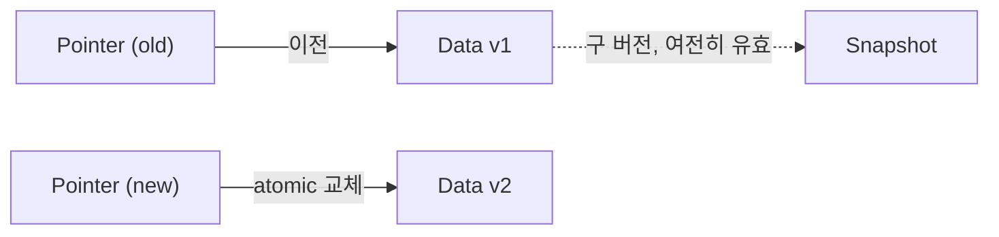

+++
date = '2025-12-25T18:00:00+09:00'
draft = false
title = '[OSTEP 용어] Copy-on-Write'
description = "OSTEP 핵심 용어 정리 - Copy-on-Write"
tags = ["OS", "OSTEP", "OS 용어"]
categories = ["OS"]
series = ["OSTEP 정리"]
+++
## 정의
데이터를 수정할 때 **기존 위치를 덮어쓰지 않고 새 위치에 기록**하는 기법. 이전 버전은 그대로 남아있어, 원자적 업데이트와 스냅샷이 자연스럽게 가능해진다.

## 동작 원리

**일반 In-place Update (덮어쓰기):**
```
디스크: [Data v1] → 수정 → [Data v2]
→ 중간에 크래시 나면? v1도 v2도 아닌 쓰레기 상태
```

**Copy-on-Write:**
```
디스크: [Data v1] (그대로 유지)
         [Data v2] (새 위치에 작성)
→ v2 작성 완료 후에 포인터만 원자적으로 업데이트
→ 중간 크래시 시 v1은 완전히 살아있음
```



**COW의 핵심 장점:**
1. **Crash consistency**: 새 위치 쓰기 완료 후에만 포인터 교체 → 크래시 안전
2. **스냅샷**: 구 버전 데이터가 남아있으므로 시점 복원 가능
3. **원자성**: 포인터 교체 하나만 atomic하면 됨

**대표 구현 사례:**
- **LFS**: 모든 쓰기를 segment에 append → 구 버전은 GC로 나중에 회수
- **ZFS**: 트리 전체를 COW로 업데이트, 스냅샷 기능 내장
- **btrfs**: Linux의 COW 파일 시스템
- **Flash FTL**: 같은 이유로 내부적으로 COW 방식 사용

## 왜 중요한가

전통적인 in-place update는 crash consistency 문제(Journaling이 필요한 이유)를 낳는다. COW는 아예 그 문제를 원천 차단한다. 단점은 구 버전 데이터를 주기적으로 정리(GC)해야 한다는 것. 현대 파일 시스템(ZFS, btrfs)과 SSD FTL이 COW를 채택한 것은 이 trade-off가 가치 있음을 증명한다.

## 관련
- 상위 개념: File System
- 관련: Journaling, RAID
- 등장 챕터: Ch.43 - Log-structured File System (LFS), Ch.44 - Flash-based SSDs
