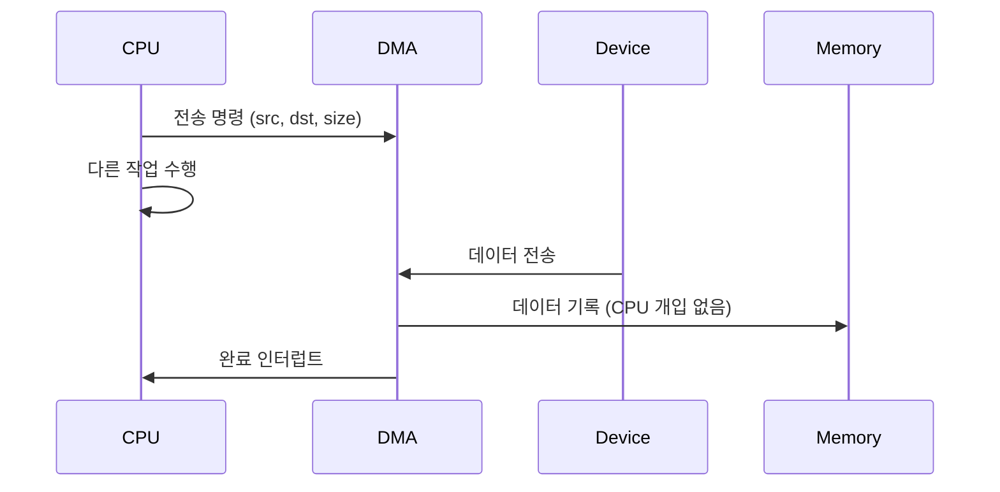

+++
date = '2025-12-30T18:00:00+09:00'
draft = false
title = '[OSTEP 용어] DMA'
description = "OSTEP 핵심 용어 정리 - DMA"
tags = ["OS", "OSTEP", "OS 용어"]
categories = ["OS"]
series = ["OSTEP 정리"]
+++
## 정의
CPU를 거치지 않고 **I/O 장치가 메모리와 직접 데이터를 주고받는** 메커니즘. CPU가 바이트 단위로 데이터를 복사하는 대신, DMA 컨트롤러에 "이 메모리 주소에서 이만큼 전송해라"라고 지시하고 CPU는 다른 일을 한다.

## 동작 원리

**DMA 없는 경우 (Programmed I/O, PIO)**:
```
CPU: 디스크 → 레지스터 → 메모리 (바이트/워드 단위 반복)
→ 전송 중 CPU가 완전히 점유됨 (busy)
```

**DMA 있는 경우**:
```
1. CPU → DMA 컨트롤러: "주소 X에서 N바이트를 메모리 Y에 복사해"
2. DMA: 메모리 버스를 직접 제어하여 데이터 전송 (CPU는 다른 프로세스 실행 가능)
3. 전송 완료 → DMA가 CPU에 인터럽트
```



## 왜 중요한가

대용량 I/O(디스크 읽기, 네트워크 패킷 수신)는 수백 KB ~ MB 단위로 전송된다. PIO 방식이라면 전송 내내 CPU가 묶이게 되어 다른 프로세스를 실행할 수 없다. DMA 덕분에 I/O와 CPU 연산을 진정한 의미로 병렬 실행할 수 있다.

## 관련
- 상위 개념: Device Driver
- 관련: Interrupt
- 등장 챕터: Ch.36 - I_O Devices
