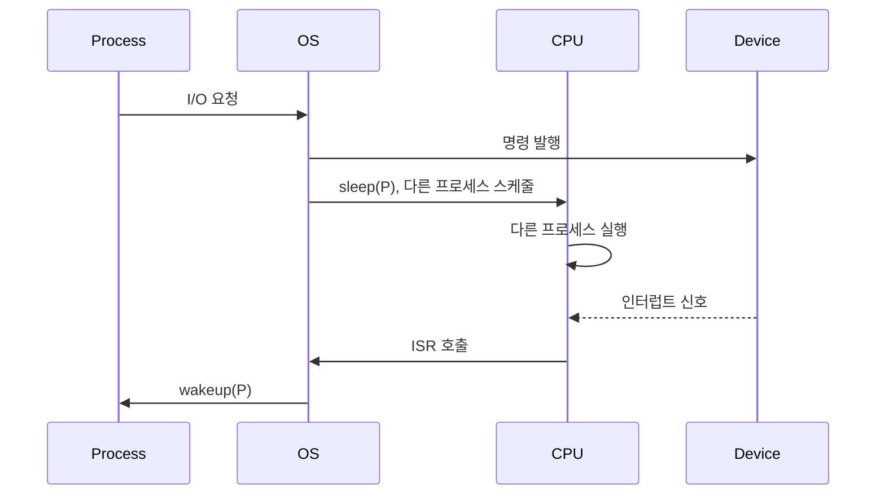

+++
date = '2026-01-10T18:00:00+09:00'
draft = false
title = '[OSTEP 용어] Interrupt'
description = "OSTEP 핵심 용어 정리 - Interrupt"
tags = ["OS", "OSTEP", "OS 용어"]
categories = ["OS"]
series = ["OSTEP 정리"]
+++
## 정의
장치가 작업을 완료했을 때 CPU에게 "다 됐어"라고 알리는 **하드웨어 신호**. CPU가 장치를 계속 쳐다보는(Polling) 대신, 장치가 먼저 CPU를 부른다.

## 동작 원리

I/O 요청 시 흐름:

```
1. OS가 장치에 I/O 요청 발행
2. 프로세스를 sleep 상태로 전환 (Context Switch)
3. CPU는 다른 프로세스 실행
4. 장치 작업 완료 → 인터럽트 라인에 신호 전송
5. CPU는 현재 명령어 완료 후 인터럽트 감지
6. 인터럽트 핸들러(ISR) 실행 — 완료 처리
7. 원래 프로세스 wakeup
```



### Polling vs Interrupt 비교

```
[Polling]
CPU:  P1─P1─P1─poll─poll─poll─poll─P1─P1
Disk:          ←──── 처리 중 ────→

[Interrupt]
CPU:  P1─P1─P1─P2─P2─P2─P2─intr─P1─P1
Disk:          ←──── 처리 중 ────→↑완료
```

Interrupt는 I/O와 연산을 **오버랩**할 수 있어 CPU 활용도가 높다.

### 언제 Polling이 더 나은가

> [!important]
> 장치가 **매우 빠를 경우** (NVMe SSD 등) 인터럽트의 컨텍스트 스위치 오버헤드가 오히려 더 크다. 이때는 짧게 Polling하는 게 낫다.
>
> **Hybrid 전략**: 처음엔 짧게 Polling → 완료 안 되면 Interrupt로 전환.

### Livelock 문제

> [!important]
> 네트워크 패킷이 폭주하면 인터럽트가 쉴 새 없이 발생 → OS가 ISR만 처리하느라 유저 프로세스가 실행 기회를 잃는다. 이 경우 Polling 기반 흐름 제어가 효과적.

## 왜 중요한가

Polling 없이 순수 대기로 I/O를 처리하면 CPU가 아무것도 못 하며 낭비된다. Interrupt 덕분에 I/O 지연 시간 동안 다른 프로세스를 실행할 수 있어, 멀티프로세스 시스템의 CPU 활용도가 극적으로 높아진다. 현대 OS의 스케줄러, 파일 시스템, 네트워크 스택 모두 Interrupt 기반으로 동작한다.

## 관련
- 상위 개념: Device Driver
- 상위 메커니즘: Trap
- 연관: DMA, System Call
- 등장 챕터: Ch.36 - I_O Devices, Ch.37 - Hard Disk Drives
