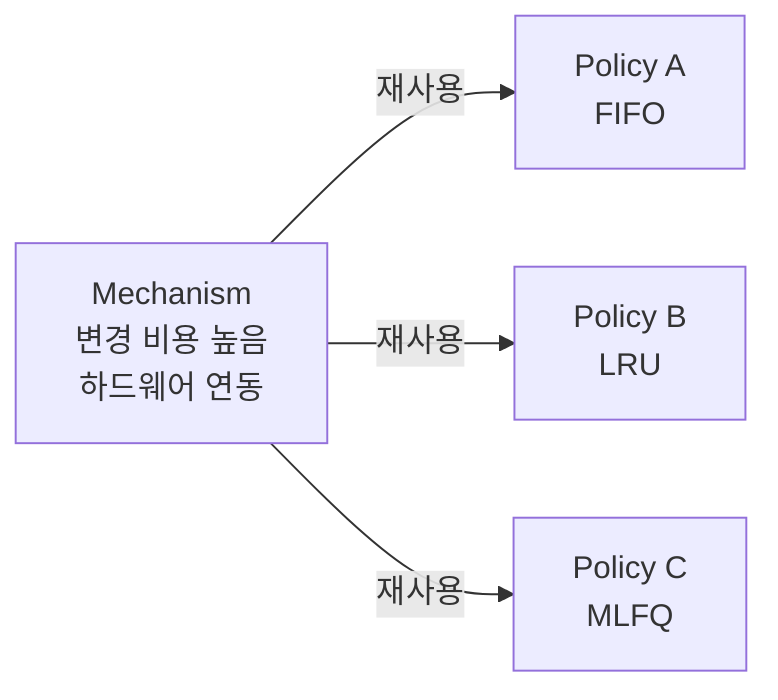

+++
date = '2026-01-17T18:00:00+09:00'
draft = false
title = '[OSTEP 용어] Mechanism vs Policy'
description = "OSTEP 핵심 용어 정리 - Mechanism vs Policy"
tags = ["OS", "OSTEP", "OS 용어"]
categories = ["OS"]
series = ["OSTEP 정리"]
+++
## 정의
OS 설계의 핵심 원칙. **Mechanism**은 "어떻게(How)"를 담당하는 구현 수단이고, **Policy**는 "무엇을(What)"을 담당하는 결정 로직이다. 둘을 분리함으로써 Policy만 교체해도 Mechanism을 재사용할 수 있다.

## 동작 원리

```
Mechanism (How)              Policy (What)
───────────────              ─────────────
Context Switch 구현          어떤 프로세스를 다음에 실행?
타이머 인터럽트 처리          CPU를 얼마나 자주 뺏을지?
페이지 교체 코드             어떤 페이지를 evict할지?
락 구현 (CAS, spin)         어떤 임계구역을 보호할지?
```

### 구체적 예시

**CPU 스케줄링:**
- Mechanism: Context Switch (레지스터 저장/복원, 타이머 Interrupt)
- Policy: FIFO, SJF, Scheduling Policy, Lottery — 어떤 프로세스를 고를지

**메모리 관리:**
- Mechanism: Page Table, TLB, Page Fault 핸들러
- Policy: LRU, FIFO, Clock — 어떤 페이지를 Swapping할지

**파일 시스템:**
- Mechanism: Inode, 블록 할당 구조
- Policy: 어느 블록에 데이터를 배치할지 (FFS의 locality 최적화 등)

### 왜 분리하는가



Policy를 바꾸고 싶을 때마다 하드웨어 연동 코드를 다시 짜야 한다면? 비용이 너무 크다. 분리하면 Policy 실험이 자유로워진다.

> [!important]
> OSTEP의 거의 모든 챕터가 이 구조를 따른다. 챕터 제목에 "Mechanism"이 붙으면 How를, "Policy"가 붙으면 What을 다룬다. (예: Ch.21 Swapping: Mechanisms / Ch.22 Swapping: Policies)

## 왜 중요한가

이 분리가 없으면 OS는 특정 워크로드에 하드코딩된 시스템이 된다. 서버용 OS와 데스크탑용 OS가 다른 스케줄링 정책을 쓰더라도 같은 Context Switch 코드를 재사용할 수 있는 것이 이 원칙 덕분이다.

## 관련
- 적용 사례: Scheduling Policy, Context Switch, Page Fault, Swapping
- 등장 챕터: Ch.02 - Introduction to Operating Systems, Ch.04 - The Abstraction - The Process
