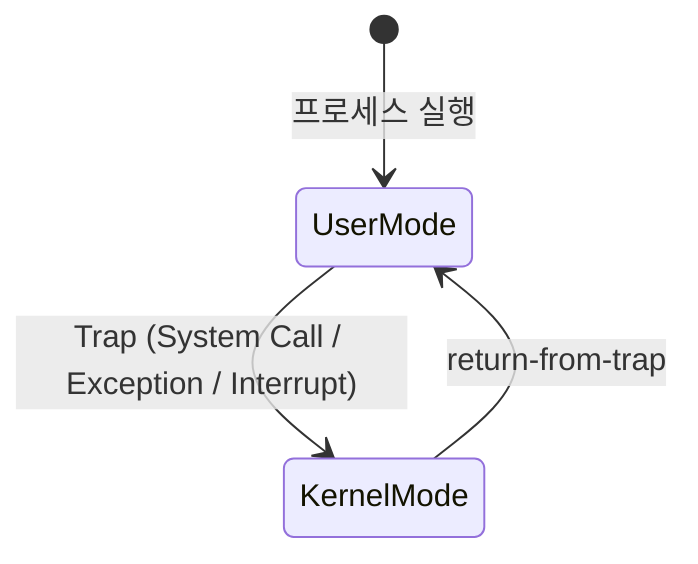

+++
date = '2026-03-03T18:00:00+09:00'
draft = false
title = '[OSTEP 용어] User Mode'
description = "OSTEP 핵심 용어 정리 - User Mode"
tags = ["OS", "OSTEP", "OS 용어"]
categories = ["OS"]
series = ["OSTEP 정리"]
+++
## 정의
CPU가 동작하는 두 가지 권한 수준. **User Mode**는 일반 프로세스가 실행되는 제한적 환경이고, **Kernel Mode**는 OS가 실행되는 전능한 환경이다. 이 분리가 없으면 프로세스가 하드웨어를 직접 건드려 시스템 전체를 망가뜨릴 수 있다.

## 동작 원리

```
User Mode (제한적)               Kernel Mode (전능)
──────────────────               ──────────────────
일반 명령어 실행                  모든 명령어 실행 가능
I/O 직접 불가                    I/O, 메모리 관리
권한 상승 명령어 불가              인터럽트 처리
다른 프로세스 메모리 접근 불가      하드웨어 직접 제어
```

### 모드 전환

User Mode → Kernel Mode 전환은 반드시 **Trap**을 통해서만 가능하다. 프로세스가 임의의 커널 주소로 점프하는 것은 허용되지 않는다.



**모드 전환이 발생하는 세 가지 경우:**

| 원인 | 예시 |
|------|------|
| System Call | `read()`, `write()`, `fork()` |
| Exception | page fault, divide by zero |
| Interrupt | 타이머, 디스크 I/O 완료 |

### 특권 명령어 (Privileged Instructions)

Kernel Mode에서만 실행 가능한 명령어들:
- I/O 장치 접근 (`in`/`out`)
- Trap Table 설정
- 인터럽트 활성화/비활성화
- 메모리 보호 설정 (page table base register 변경)

User Mode에서 특권 명령어를 실행하려 하면 → **하드웨어가 Exception 발생** → OS가 프로세스 종료

## 왜 중요한가

이 분리가 OS **보호(Protection)** 의 근간이다. User Mode 제약 덕분에:
- 프로세스가 다른 프로세스의 메모리를 읽거나 망가뜨릴 수 없다
- 프로세스가 하드웨어를 직접 점유할 수 없다
- OS가 언제든 CPU를 되찾을 수 있다 (타이머 인터럽트)

> [!important]
> "프로세스에게 CPU를 주되, 통제권은 OS가 유지한다" — Limited Direct Execution의 핵심.

## 관련
- 전환 메커니즘: Trap, System Call, Interrupt
- 등장 챕터: Ch.06 - Mechanism - Limited Direct Execution, Ch.04 - The Abstraction - The Process
